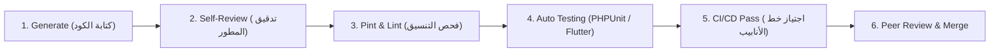

# قواعد التكامل والنشر المستمر والاختبارات التلقائية (CI/CD & Automated Testing)

تحدد هذه القاعدة الإطار الإلزامي لاختبار الأكواد والتحقق من جودتها وتنسيقها وأمانها تلقائياً قبل دمجها أو نشرها عبر خطوط أنابيب GitHub Actions.

## 1. مراحل ومستويات الاختبارات التلقائية (Testing Levels)
1. **فحص التنسيق والجودة (Pint & Lint Testing):**
   - **Laravel Pint:** فحص تنسيق أكواد PHP بالكامل وإلزام التوافق مع معايير PSR-12 و Laravel Coding Style:
     ```bash
     ./vendor/bin/pint --test
     ```
   - **Flutter Analyze:** فحص الكود الساكن وتطبيق معايير Effective Dart وتحذيرات الـ Linter:
     ```bash
     flutter analyze
     ```
2. **اختبارات الوحدة (Unit Testing):**
   - اختبار منطق الحجز وتناقص المخزون ومؤقتات الـ TTL بشكل معزول عبر PHPUnit / Pest.
   - اختبار وحدات الـ Business Logic ونماذج البيانات في Flutter عبر `flutter test`.
3. **اختبارات التكامل والواجهات (Feature & Integration Testing):**
   - اختبار تكامل مسارات الـ RESTful APIs، والتحقق من صحة الاستجابات وكود الحالة (Status Codes: 200, 201, 400, 404, 422).
   - اختبار التعامل المتزامن وحماية العمليات المتزامنة في قواعد البيانات.

---

## 2. مراحل مراجعة الكود على GitHub (GitHub Code Review Lifecycle)
قبل دمج أي Pull Request، يجب استيفاء المراحل التالية بالترتيب:


## 3. خطوط أنابيب GitHub Actions الإلزامية:
- يجب أن يجتاز كل Pull Request فحصين آليين مستقلين:
  1. `backend-ci.yml`: يختبر كود الخادم، يشغل Laravel Pint، ويشغل اختبارات PHPUnit مع قاعدة بيانات MySQL اختبارية.
  2. `frontend-ci.yml`: يختبر كود Flutter، يتحقق من التحليل الساكن، ويشغل اختبارات الـ Widgets والـ Unit.
- يمنع دمج أي فرع يفشل في اجتياز خط الأنابيب.
