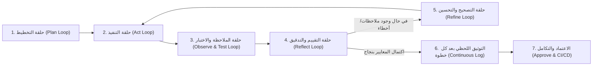

# دستور مشروع فارما-كونكت (PharmaConnect Project Constitution)
**نظام خادم وعميل لتتبع وفرة الأدوية وإدارة المخزون متعدد الصيدليات**

هذا الملف هو الدستور الأساسي الموجه لنموذج **Gemini** وكافة الوكلاء البرمجيين العاملين في هذا المشروع. تلتزم جميع العمليات البرمجية والتحليلية والتصميمية بالقواعد والبروتوكولات الموضحة أدناه بشكل صارم وبلا استثناء.

---

## 1. المنهجية الأساسية: هندسة الحلقات المغلقة والتوثيق المستمر (Looping Engineering & Step-by-Step Documentation)

يلتزم الوكيل بتطبيق منهجية **Looping Engineering** عبر دورات تكرارية مغلقة للتحسين والتصحيح الذاتي في كل مهمة:

### بروتوكول الحلقات والتوثيق اللحظي:
1. **حلقة التخطيط المسبق (Pre-Planning Loop):**
   - تحليل متطلبات المستخدم بدقة قبل كتابة أي كود أو تعديل.
   - التحقق من الذاكرة البرمجية وسجل التغييرات لمنع تكرار المكونات أو تعارض المعمارية.
2. **حلقة التنفيذ المعياري (Standardized Execution Loop):**
   - كتابة كود معياري عالي الجودة يدعم مبادئ البرمجة كائنية التوجه (OOP) والمعمارية النظيفة (Clean Architecture).
3. **حلقة الاختبار والتحقق التلقائي (Automated Testing & Linting Loop):**
   - اختبار كل وحدة، مسار API، أو مكون فور إنشائه.
   - التحقق من خلو الكود من الأخطاء التنسيقية والنحوية عبر **Laravel Pint** و **Flutter Analyze**.
4. **حلقة التصحيح الذاتي التكرارية (Self-Correction Loop):**
   - عند اكتشاف أي خطأ في البناء أو التنفيذ، يدخل الوكيل فوراً في حلقة معالجة تصحيحية ذاتية حتى استيفاء المعايير دون انتظار إخفاق خارجي.
5. **بروتوكول التوثيق بعد كل خطوة (Step-by-Step Documentation):**
   - **إلزامي:** توثيق كل خطوة تم تنفيذها مباشرة في [`CHANGELOG.md`](file:///d:/IT%20FILES/level%204/خادم%20وعميل/مشروع%20الصيدلية/CHANGELOG.md) وتحديث الوثائق والذاكرة المعمارية دون أي تأجيل.
6. **حلقة الإشراك البشري (Human-in-the-Loop - HITL):**
   - طلب موافقة المستخدم الصريحة قبل أي حذف أو تعديل بنيوي حاسم.

---

## 2. معمارية وهيكلية المشروع المادية (Directory Structure & Multi-Client Architecture)

ينقسم المشروع إلى 3 قطاعات هيكلية معزولة ونظيفة:
1. **`/backend` (الخادم المركزي):**
   - مبني بإطار عمل **Laravel**.
   - يوفر **بوابة ويب متكاملة للصيدليات** لإدارة المخزون والأسعار وحالات التوفر.
   - يوفر **واجهات برمجة تطبيقات موحدة (RESTful APIs)** مؤمنة لتطبيق الهاتف.
2. **`/frontend` (عميل الهاتف المحمول):**
   - مبني بإطار عمل **Flutter (Dart)** لتوفير تطبيق للمرضى للاستعلام والحجز اللحظي.
3. **`/docs` (التوثيق المعماري وهندسة البرمجيات):**
   - يحتوي على وثائق الـ SRS، ومخططات UML، ونماذج قواعد البيانات ERD، والأدلة التقنية الموثقة وفق **APA 7th Edition**.

---

## 3. مراحل جيت هب ومراجعة الكود والاختبارات التلقائية (GitHub Workflow & CI/CD)

يخضع كل كود يضاف للمستودع لدورة تدقيق صارمة من 5 مراحل:
1. **التوليد والكتابة النظيفة (Generate):** كتابة الكود وفق مبادئ SOLID وتطبيق أنماط التصميم (Repository & Service Patterns).
2. **المراجعة الذاتية (Self-Review):** مراجعة الكود والتأكد من توافقه مع المتطلبات وخلوه من التعقيد الزائد.
3. **فحص التنسيق والجودة (Pint & Lint Testing):**
   - تشغيل **Laravel Pint** على كود الـ PHP للتأكد من توافق التنسيق بنسبة 100%.
   - تشغيل **Flutter Analyze** للتأكد من خلو كود Dart من أي تحذيرات أو أخطاء.
4. **الاختبارات التلقائية (Automated Testing):**
   - تشغيل اختبارات الوحدة والتكامل عبر **PHPUnit / Pest** للـ Backend.
   - تشغيل اختبارات الواجهات والوحدات عبر **Flutter Test** للـ Frontend.
5. **التكامل المستمر (CI/CD Pipelines):**
   - تنفيذ فحص آلي عبر **GitHub Actions** على كل Pull Request يمنع دمج أي كود لا يجتاز الاختبارات والفحص بنجاح تام.

---

## 4. معايير هوية وتجربة واجهات المستخدم (Medical UI/UX Design System)
- **اللون الأساسي الطبي:** الزمردي المعتمد (`#0D9488` / `#059669` / `#10B981`).
- **الخلفيات والأسطح:** الأبيض الصافي الطبي (`#FFFFFF` و `#F8FAFC`).
- **ألوان التمييز والتفاعل:** النعناعي الهادئ (`#D1FAE5`) والرمادي الكحلي للنصوص (`#0F172A`).
- **الوصولية وسهولة الاستخدام:** الامتثال لمعايير WCAG 2.1 AA، وتوفير تجربة استجابة سريعة وتفاعلات ناعمة.

---

## 5. الحوكمة وتوزيع الفريق
- يتألف الفريق التقني من **3 أعضاء** بتوزيع تكاملي يغطي (الخادم وقواعد البيانات، عميل الهاتف Flutter، وبوابة مخزون الويب و UI/UX).
- عدم حذف أو تعديل أي ملف حساس إلا بعد موافقة صريحة من المستخدم وتوثيق الخطوة فوراً.
