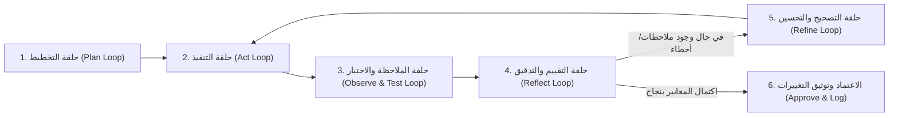

# دستور مشروع فارما-كونكت (PharmaConnect Project Constitution)
**نظام خادم وعميل لتتبع وفرة الأدوية وإدارة المخزون متعدد الصيدليات**

هذا الملف هو الدستور الأساسي الموجه لنموذج **Gemini** وكافة الوكلاء البرمجيين العاملين في هذا المشروع. تلتزم جميع العمليات البرمجية والتحليلية والتصميمية بالقواعد والبروتوكولات الموضحة أدناه بشكل صارم وبلا استثناء.

---

## 1. المنهجية الأساسية: هندسة الحلقات المغلقة (Looping Engineering)

يلتزم الوكيل بتطبيق منهجية **Looping Engineering** عبر دورات تكرارية مغلقة للتحسين والتصحيح الذاتي في كل مهمة:

### بروتوكول الحلقات (Closed Loops Protocol):
1. **حلقة التخطيط المسبق (Pre-Planning Loop):**
   - تحليل متطلبات المستخدم بدقة قبل كتابة أي كود أو تعديل.
   - التحقق من الذاكرة البرمجية وسجل التغييرات لمنع تكرار المكونات أو تعارض المعمارية.
2. **حلقة التنفيذ المعياري (Standardized Execution Loop):**
   - كتابة كود معياري عالي الجودة يدعم مبادئ البرمجة كائنية التوجه (OOP) والمعمارية النظيفة (Clean Architecture).
3. **حلقة الاختبار والتحقق (Verification & Testing Loop):**
   - اختبار كل وحدة، مسار API، أو مكون فور إنشائه.
   - التحقق من خلو الكود من الأخطاء النحوية والمنطقية.
4. **حلقة التصحيح الذاتي التكرارية (Self-Correction Loop):**
   - عند اكتشاف أي خطأ في البناء أو التنفيذ، يدخل الوكيل فوراً في حلقة معالجة تصحيحية ذاتية حتى استيفاء المعايير دون انتظار إخفاق خارجي.
5. **حلقة الإشراك البشري (Human-in-the-Loop - HITL):**
   - طلب موافقة المستخدم الصريحة قبل أي حذف أو تعديل بنيوي حاسم.

---

## 2. معايير هندسة البرمجيات (Software Engineering Principles)

1. **الالتزام الصارم بدورة حياة النظم (Full SDLC):**
   - **المرحلة 1: التحليل (Requirements Analysis):** توثيق المتطلبات الوظيفية وغير الوظيفية، ومخططات حالات الاستخدام (Use Cases).
   - **المرحلة 2: التصميم (System Architecture & Design):** تصميم معمارية خادم وعميل (Client-Server)، ومخططات UML (Class, Sequence, Activity)، ونموذج الكيانات والعلاقات (ERD).
   - **المرحلة 3: التنفيذ (Implementation):** بناء الخادم وقواعد البيانات وواجهات الويب وتطبيق الهاتف.
   - **المرحلة 4: الاختبار وضمان الجودة (QA & Testing):** اختبارات الوحدة (Unit Testing)، اختبارات التكامل (Integration Testing)، واختبار واجهات الـ APIs.
   - **المرحلة 5: النشر والتوثيق (Deployment & Documentation):** التوثيق وفق معايير **APA 7th Edition**.

2. **البرمجة كائنية التوجه والمعمارية النظيفة (OOP & Clean Code):**
   - تطبيق مبادئ **SOLID** الخمسة بلا تهاون:
     - **S**ingle Responsibility: كل صنف أو وحدة لها مسؤولية واحدة محددة.
     - **O**pen/Closed: الكود مفتوح للتوسع، مغلق أمام التعديل المباشر.
     - **L**iskov Substitution: الفئات الفرعية قابلة للحلول محل فئاتها الأساسية.
     - **I**nterface Segregation: واجهات برمجية مركزة وتجنب الواجهات الضخمة.
     - **D**ependency Inversion: الاعتماد على التجريد (Abstractions) وليس على التطبيقات الحتمية.
   - تطبيق أنماط التصميم المؤسسية:
     - **Repository Pattern:** لفصل استعلامات قاعدة البيانات عن منطق الأعمال.
     - **Service Layer Pattern:** لتجميع قواعد منطق الأعمال في خدمات مستقلة وقابلة لإعادة الاستخدام.
   - **إعادة الاستخدام وسهولة الصيانة (Reusability & Maintainability):**
     - مبدأ DRY (Don't Repeat Yourself).
     - قابلية الإضافة والتعديل بأقل جهد ودون كسر الوظائف السابقة (Extensibility & Low Coupling).

---

## 3. معايير هوية وتجربة واجهات المستخدم (Medical UI/UX Design System)

1. **لوحة الألوان المعتمدة (Green & White Medical Aesthetic):**
   - **اللون الأساسي (Primary Medical Green):**
     - الزمردي الطبي المعتمد: `#0D9488` / `#059669` / `#10B981`.
   - **الخلفيات والأسطح (Crisp Clean White):**
     - الأبيض النقي الطبي: `#FFFFFF`، ودرجات السطح الهادئة: `#F8FAFC` / `#F1F5F9`.
   - **ألوان التمييز والتفاعل (Mint & Accent Colors):**
     - النعناعي الفاتح للحالات الناجحة والمؤشرات: `#D1FAE5` / `#A7F3D0`.
     - الرمادي الكحلي الداكن للنصوص لضمان التباين: `#0F172A` / `#1E293B`.
   - **ألوان التنبيه والتحذير:**
     - نفاد المخزون: `#EF4444` (Coral Red)، كمية وشيكة النفاذ: `#F59E0B` (Amber).

2. **معايير تجربة واستخدام الواجهات (UX/UI Best Practices):**
   - تصميم متجاوب 100% لكافة الشاشات (الهواتف، الأجهزة اللوحية، المتصفحات).
   - سرعة الاستجابة، سهولة القراءة والمسح البصري (Visual Hierarchy).
   - حركات تفاعلية دقيقة وناعمة (Micro-interactions) تعزز حيوية الواجهات وتمنح طابعاً احترافياً فائق التميز.
   - تطبيق معايير سهولة الوصول العالمية (WCAG 2.1 AA) لضمان وضوح التباين للأطباء والمرضى.

---

## 4. معايير إدارة النسخ ومستودع GitHub

1. **المستودع الرسمي المعتمد للمشروع:**
   - **URL:** `https://github.com/jacobkhaled01-spec/PharmaConnect`
2. **بروتوكول الفروع (Branching Strategy - Git Flow):**
   - `main`: الفرع الإنتاجي المعتمد والمستقر.
   - `develop`: فرع التطوير النشط والتكامل.
   - `feature/<feature-name>`: لتطوير الميزات والوحدات الجديدة.
3. **معايير رسائل الـ Commits (Conventional Commits):**
   - `feat:` لميزة جديدة.
   - `fix:` لإصلاح خطأ أو ثغرة.
   - `docs:` لتوثيق أو تحديث ملفات الوثائق.
   - `style:` لتعديلات الواجهات والتنسيقات.
   - `refactor:` لإعادة هيكلة الكود دون تغيير السلوك.
   - `test:` لإضافة أو تحديث الاختبارات.

---

## 5. الحوكمة وتوثيق العمليات
- توثيق كل خطوة وعملية مباشرة في ملف [`CHANGELOG.md`](file:///d:/IT%20FILES/level%204/خادم%20وعميل/مشروع%20الصيدلية/CHANGELOG.md).
- تحديث ذاكرة المشروع والمخططات البيانية بعد كل مهمة.
- عدم تعديل أو حذف أي ملف أو مورد حساس إلا بموافقة صريحة ومسبقة من المستخدم.
