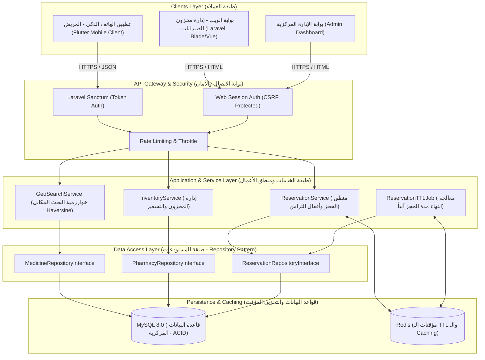
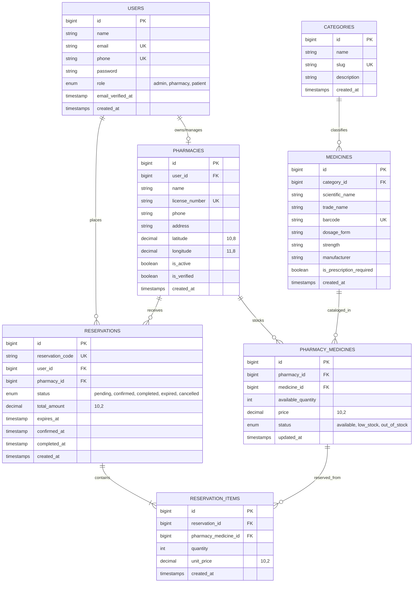
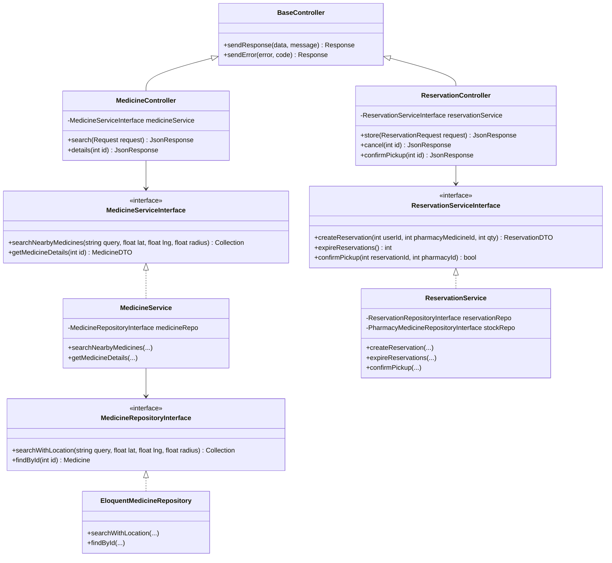
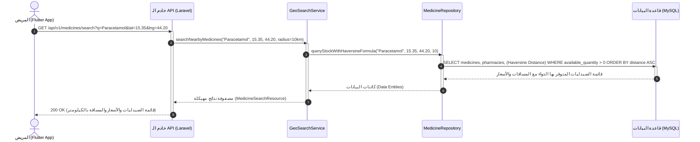
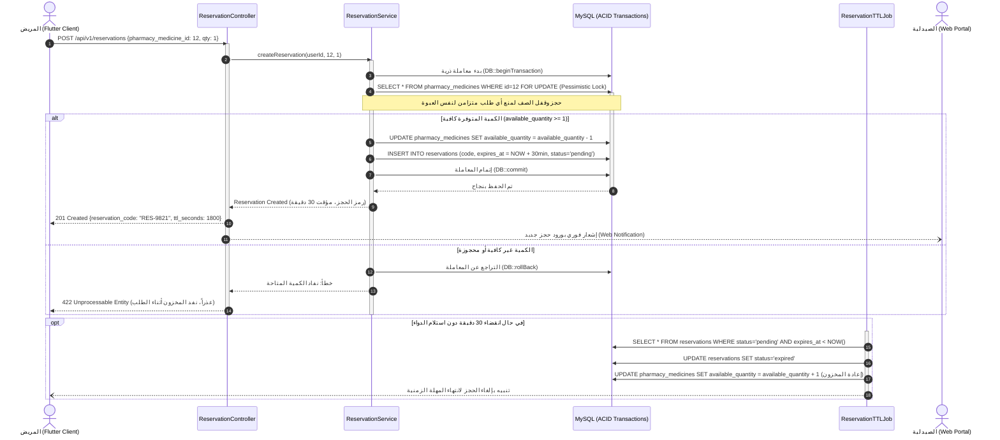
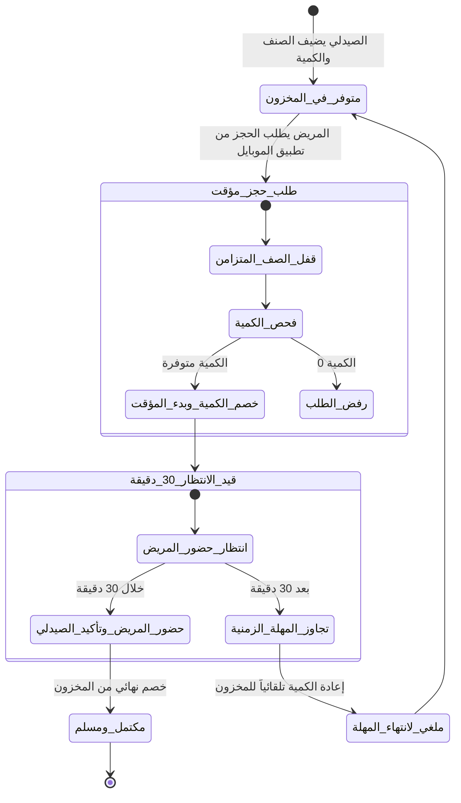

# وثيقة التصميم المعماري والنمذجة وقواعد البيانات (System Architecture & Design Document)
**مشروع:** فارما-كونكت (PharmaConnect)  
**المقرر:** خادم وعميل (Client-Server Architecture) - المستوى الرابع  
**المعيار:** متوافق مع معايير هندسة البرمجيات ونمذجة UML وتوثيق APA 7th Edition  
**التاريخ:** 2026-09-18  
**النسخة:** 1.0 (معتمدة للمرحلة الثانية)  

---

## 1. المعمارية العامة للنظام (High-Level System Architecture)

يعتمد نظام **PharmaConnect** معمارية الخادم والعميل متعددة الطبقات (Multi-Layered Client-Server Architecture) مع دعم العزل المنطقي للصيدليات (Multi-Tenant Logical Isolation):



---

## 2. تصميم قاعدة البيانات ونموذج الكيانات والعلاقات (Database Schema & ERD)

### 2.1 مخطط الكيانات والعلاقات (Entity-Relationship Diagram - ERD)



### 2.2 التحقق من درجات التطبيع (Database Normalization - 3NF)
1. **النموذج الأولي (1NF):** كافة الحقول ذرية (Atomic)، ولا توجد مصفوفات أو بيانات مكررة داخل الحقل الواحد.
2. **النموذج الثاني (2NF):** كل جدول يمتلك مفتاحاً رئيسياً أحادياً (`id`)، وجميع الحقول غير المفتاحية تعتمد اعتماداً وظيفياً كاملاً على المفتاح الرئيسي.
3. **النموذج الثالث (3NF):** لا يوجد أي اعتماد انتقالي (Transitive Dependency) بين الحقول غير المفتاحية؛ حيث تم فصل بيانات الفئات والكيانات المستقلة (مثل `categories` و `pharmacy_medicines`) في جداول منفصلة.

### 2.3 استراتيجية الفهارس والأداء (Indexing Strategy)
- **فهرس البحث المكاني (Spatial / Composite Index):**  
  فهرس مركب على `PHARMACIES (latitude, longitude)` لتسريع استعلامات البحث الجغرافي وحساب المسافة دون عمل Full Table Scan.
- **فهرس فريد مركب (Unique Composite Index):**  
  `PHARMACY_MEDICINES (pharmacy_id, medicine_id)` لمنع تكرار نفس الدواء في مخزون الصيدلية الواحدة وضمان نزاهة البيانات.
- **فهارس البحث النصي (B-Tree Search Indexes):**  
  فهارس على `MEDICINES (scientific_name)`, `MEDICINES (trade_name)`, و `MEDICINES (barcode)`.
- **فهرس مؤقتات الحجز (Index on Reservations Expiry):**  
  فهرس على `RESERVATIONS (status, expires_at)` لتسريع مهمة الخلفية (Scheduled Job) التي تلغي الحجوزات المنتهية كل دقيقة.

---

## 3. مخططات لغة النمذجة الموحدة (UML Diagrams)

### 3.1 مخطط الفئات كائنية التوجه (UML Class Diagram)
يطبق المخطط مبادئ SOLID ونمط الـ **Repository & Service Pattern**:



---

### 3.2 مخطط التتابع لمسار البحث الجغرافي اللحظي (Sequence Diagram: Geo-Search)



---

### 3.3 مخطط التتابع للحجز المؤقت والتحكم بالتزامن (Sequence Diagram: Concurrency Reservation)



---

### 3.4 مخطط الأنشطة لدورة حياة المخزون والحجز (UML Activity Diagram)



---

## 4. معايير واجهات برمجة التطبيقات (RESTful API Specifications)

### 4.1 المعايير المعتمدة:
- **تنسيق البيانات:** JSON حصراً في الطلب والاستجابة (`Content-Type: application/json`, `Accept: application/json`).
- **المصادقة:** ترويسة المصادقة المعتمدة: `Authorization: Bearer <Sanctum-Token>`.
- **أكواد الحالة القياسية (HTTP Status Codes):**
  - `200 OK`: نجاح الاستعلام واسترجاع البيانات.
  - `201 Created`: نجاح إنشاء الحجز أو الحساب.
  - `400 Bad Request`: خطأ في صياغة المدخلات.
  - `401 Unauthorized`: غياب التوكن أو انتهاء صلاحيته.
  - `403 Forbidden`: محاولة الوصول لمورد غير مصرح (مثال: صيدلي يحاول تعديل مخزون صيدلية أخرى).
  - `404 Not Found`: الصنف أو الصيدلية غير موجودة.
  - `422 Unprocessable Entity`: فشل التحقق من صحة الحقول (Validation Failed) أو نفاد المخزون أثناء الحجز.
  - `500 Internal Server Error`: خطأ داخلي في الخادم مع تسجيل السجل (Log) في بيئة معزولة.

### 4.2 نماذج الاستجابة الموحدة (Standard JSON Response Structure):

* **استجابة النجاح (Success Response):**
```json
{
  "success": true,
  "message": "تم العثور على الأدوية بنجاح",
  "data": [
    {
      "medicine_id": 105,
      "trade_name": "Panadol Extra",
      "scientific_name": "Paracetamol + Caffeine",
      "pharmacy": {
        "id": 14,
        "name": "صيدلية الشفاء المركزية",
        "distance_km": 1.4,
        "address": "شارع حدة - صنعاء",
        "phone": "+967771234567"
      },
      "price": 1200.00,
      "currency": "YER",
      "status": "available",
      "stock_quantity": 8
    }
  ],
  "meta": {
    "count": 1,
    "search_radius_km": 10
  }
}
```

* **استجابة الخطأ (Error Response):**
```json
{
  "success": false,
  "message": "عذراً، نفد المخزون أثناء معالجة الحجز",
  "errors": {
    "pharmacy_medicine_id": ["الكمية المطلوبة غير متوفرة حالياً في هذه الصيدلية"]
  }
}
```

---

## 5. معايير التصميم وتدفق الشاشات (UI/UX Screen Flow)

### 5.1 تدفق شاشات تطبيق الهاتف (Flutter Flow):
1. **شاشة Splash:** شعار المنصة بالأخضر الزمردي وخلفية بيضاء نقية مع مؤشر تحميل ناعم.
2. **شاشة الاستكشاف والبحث الرئيسية:**
   - شريط بحث ذكي مزود بقارئ باركود ومحدد تلقائي للموقع الجغرافي.
   - تصنيفات سريعة (أدوية شائعة، مضادات حيوية، أدوية مزمنة).
3. **شاشة نتائج الصيدليات والأسعار:**
   - بطاقات بيضاء ناعمة بظلال هادئة تعرض اسم الصيدلية، المسافة بالأمتار/الكيلومتر، السعر، وشارة الحالة (متوفر بالأخضر / وشيك النفاذ بالبرتقالي).
4. **شاشة تفاصيل الدواء والحجز المؤقت:**
   - عرض الجرعة والشركة المصنعة والبدائل العلمية المتوفرة في صيدليات أخرى.
   - زر الحجز الفوري الأخضر (عرض مدة الحجز: 30 دقيقة).
5. **شاشة تذكرة الحجز اللحظية (Reservation Pass):**
   - كود الحجز (QR Code ورقم مميز) + مؤقت عد تنازلي حي (Live Countdown) حتى انتهاء الـ 30 دقيقة.

### 5.2 تدفق شاشات بوابة ويب الصيدلية (Laravel Web Flow):
1. **شاشة تسجيل الدخول للصيدلية:** تسجيل آمن باسم المستخدم والرقم السري.
2. **لوحة التحكم الرئيسية (Dashboard):** مؤشرات رقمية للكميات المتوفرة، الحجوزات النشطة، والتنبيهات.
3. **شاشة إدارة المخزون (Inventory Grid):** جدول تفاعلي لتعديل الكمية والسعر بنقرة واحدة وتفعيل/تعطيل توفر الصنف.
4. **شاشة الحجوزات الواردة (Live Orders):** قائمة لحظية بالحجوزات مع زر "تأكيد التسليم والمحاسبة" وزر "إلغاء".

---

## 6. المراجع العلمية (References - APA 7th Edition)
1. Sommerville, I. (2016). *Software Engineering* (10th ed.). Pearson Education.
2. Fowler, M. (2002). *Patterns of Enterprise Application Architecture*. Addison-Wesley Professional.
3. Gamma, E., Helm, R., Johnson, R., & Vlissides, J. (1994). *Design Patterns: Elements of Reusable Object-Oriented Software*. Addison-Wesley.
4. Fielding, R. T. (2000). *Architectural Styles and the Design of Network-based Software Architectures* (Doctoral dissertation). University of California, Irvine.
5. Elmasri, R., & Navathe, S. B. (2015). *Fundamentals of Database Systems* (7th ed.). Pearson.
