# دليل وسيناريو مناقشة المشروع أمام اللجنة الأكاديمية
## (PharmaConnect: Academic Defense & Live Demo Guide)
**مشروع نظام تتبع وفرة الأدوية وإدارة المخزون — مقرر خادم وعميل (Level 4)**

---

## 1. خطة زمنية مقترحة للعرض التقديمي (15 دقيقة)

```mermaid
gantt
    title الخطة الزمنية لعرض المناقشة أمام اللجنة (15 دقيقة)
    dateFormat  m
    axisFormat %M دقيقة
    
    المقدمة والمشكلة والهدف (العضو 1) :a1, 0, 3m
    المعمارية وقواعد البيانات والـ API (العضو 1) :a2, after a1, 3m
    تطبيق الهاتف المحمول وتجربة المريض (العضو 2) :a3, after a2, 3m
    بوابة الويب والـ CI/CD والنتائج (العضو 3) :a4, after a3, 3m
    العرض الحي المشترك (Live Demo) (كامل الفريق) :a5, after a4, 3m
```

---

## 2. توزيع الأدوار والحديث التخصصي لكل باحث

### 🎙️ المتحدث الأول: مسؤول المعمارية والخادم وقواعد البيانات
- **زمن الحديث:** 00:00 - 05:00
- **النقاط الجوهرية:**
  1. **المشكلة الحقيقية:** أزمة البحث اليدوي عن الدواء ومعاناة المرضى.
  2. **الحل المعماري:** لماذا اخترنا نظام خادم وعميل هجين (بوابة ويب للصيدلية + واجهات API مركزية + عميل هاتف للمريض) بدلاً من افتراض وجود واجهات API لدى الصيدليات.
  3. **هندسة البيانات (3NF Database):** شرح الجداول السبعة، والترابط العلائقي، وتفادي تكرار بيانات الأدوية عبر الربط في `pharmacy_medicines`.
  4. **خوارزمية هافرسين وقفل التزامن:** كيف يحسب الخادم المسافة الجغرافية بالكيلومتر لحظياً، وكيف يحمي `lockForUpdate` المخزون من الحجز المزدوج في نفس اللحظة.

### 📱 المتحدث الثاني: مهندس عميل الهاتف المحمول (Flutter Lead)
- **زمن الحديث:** 05:00 - 09:00
- **النقاط الجوهرية:**
  1. **هيكلية تطبيق Flutter:** تطبيق مبادئ Clean Architecture وفصل الطبقات (Core, Data, Presentation).
  2. **البحث التفاعلي والـ Resilience:** كيف يتصل التطبيق بـ API Gateway، وكيف يتعامل بسلاسة مع انقطاع الشبكة من خلال الـ Fallback المدمج.
  3. **تذكرة الحجز الذكية ومؤقت الـ TTL:** شرح تذكرة المريض الرقمية الحاوية لكود الاستلام، ومؤقت العد التنازلي التفاعلي المبرمج على 30 دقيقة.
  4. **نظام التصميم الطبي:** التزام واجهات المريض باللون الأخضر الزمردي والأبيض الصافي وسهولة الوصول لذوي الاحتياجات.

### 💻 المتحدث الثالث: مسؤول بوابة الويب وضمان الجودة و CI/CD
- **زمن الحديث:** 09:00 - 12:00
- **النقاط الجوهرية:**
  1. **بوابة الويب للصيدليات:** تمكين الصيدلي من تعديل الأسعار، ومراقبة المخزون الحرج، واستقبال إشعارات الحجز اللحظية.
  2. **دورة حياة هندسة البرمجيات (SDLC) ومنهجية الحلقات المغلقة (Looping Engineering):** شرح كيف قاد الفريق التطوير من الـ SRS والـ UML إلى النشر النهائي.
  3. **خطوط أنابيب CI/CD على GitHub:** استعراض الفحص التلقائي على كل Pull Request باستخدام **Laravel Pint** و **PHPUnit** و **Flutter Analyze** واجتياز 47 اختباراً بنسبة 100%.

---

## 3. خطوات العرض العملي الحي (Interactive Live Demo Sequence)

| الترتيب | الشاشة / البيئة | الإجراء العملي المشاهد أمام اللجنة | النتيجة التقنية المتوقعة |
| :---: | :--- | :--- | :--- |
| **1** | بوابة الويب (متصفح الصيدلية) | الصيدلي يسجل الدخول ويغير كمية دواء **Panadol Extra** من 10 إلى 25 علبة وسعره إلى 1350 ريال. | حفظ فوري في قاعدة البيانات مع رسالة نجاح. |
| **2** | تطبيق الهاتف (شاشة المريض) | فتح التطبيق، كتابة "Panadol" في حقل البحث. | ظهور صيدلية الشفاء فوراً مع الكمية المحدثة (25) والسعر الجديد (1350) والمسافة الجغرافية الدقيقة. |
| **3** | تطبيق الهاتف (شاشة التفاصيل) | المريض يختار حجز عبوتين ويضغط "حجز مؤكد الآن". | انتقال فوري لشاشة التذكرة برمز `RES-XXXXXX` ومؤقت تنازلي (29:59). |
| **4** | قاعدة البيانات والويب | فحص المخزون فوراً على صفحة الويب للصيدلية. | انخفاض المخزون آلياً من 25 إلى 23 علبة وظهور الطلب في شاشة الحجوزات الواردة. |
| **5** | بوابة الويب (تأكيد التسليم) | الصيدلي يدخل كود الحجز ويضغط "تأكيد تسليم الدواء". | تحول حالة الحجز فورياً إلى `completed` وإغلاق المعاملة بنجاح. |
| **6** | تيرمينال الاختبارات الآلية | تشغيل أمر `php artisan test` و `flutter test`. | اجتياز كافة الاختبارات الـ 47 بنسبة 100% أمام أعضاء اللجنة. |

---

## 4. أبرز الأسئلة المتوقعة من اللجنة الأكاديمية وإجاباتها النموذجية

### س1: ما الفرق بين نظامكم وفكرة إنشاء واجهات API للصيدليات للربط مع أنظمتها المحلية؟
- **الإجابة النموذجية:** في الواقع العملي، الصيدليات الأهلية تستخدم برامج محاسبية مغلقة ومتباينة ولا تمتلك واجهات برمجية عامة أو خوادم ذات عناوين IP ثابتة. لذا قمنا بتصميم معمارية هجينة عملية: وفرنا بوابة ويب مركزية متجاوبة وخفيفة يستطيع الصيدلي فتحها من أي جهاز أو متصفح لتحديث أسعاره ومخزونه وتأكيد الحجوزات، بينما يتصل تطبيق الهاتف بنفس الخادم المركزي عبر واجهات RESTful APIs موحدة؛ مما يضمن موثوقية 100% وسرعة انتشار دون عوائق تقنية.

### س2: كيف تعالج مشكلة طلب حجز نفس العبوة الأخيرة من مريضين في نفس الجزء من الثانية؟ (Race Condition)
- **الإجابة النموذجية:** استخدمنا نمط المعاملات الذرية `DB::transaction()` مع تطبيق القفل التشاؤمي لصفوف قاعدة البيانات `PharmacyMedicine::where(...)->lockForUpdate()->first()`. يقوم محرك InnoDB بتعليق الطلب الثاني على مستوى الصف في أجزاء من الملي ثانية حتى تنتهي معاملة الأول بخصم الكمية؛ وعندها يقدم الطلب الثاني فيجد أن الكمية أصبحت صفر، فيرفض طلبه فورياً بأمان مع رسالة خطأ ملائمة تمنع البيع المزدوج نهائياً.

### س3: ما الذي يضمن عدم قيام مستخدم بحجز الدواء وتعطيل الصيدلية دون الذهاب لاستلامه؟
- **الإجابة النموذجية:** طبقنا معمارية مهلة الاحتجاز الزمنية (TTL: Time-To-Live) المحددة بـ 30 دقيقة. إذا لم يقم المريض بالحضور وتأكيد الصيدلي لعملية الاستلام خلال هذه المهلة، يقوم الخادم آلياً عبر `expirePendingReservations()` بتحويل حالة الحجز إلى `expired` وإعادة الكميات المحجوزة فورياً للمخزون المتاح للجمهور.

### س4: كيف تم تطبيق مبادئ البرمجة كائنية التوجه (OOP) والمعمارية النظيفة؟
- **الإجابة النموذجية:** تم تطبيق نمط المستودعات والخدمات (Repository and Service Patterns)؛ حيث فُصلت استعلامات البيانات داخل Interfaces محددة مثل `MedicineRepositoryInterface` و `ReservationRepositoryInterface`، وفُصل منطق الأعمال المعقد (Business Logic) داخل خدمات مستقلة مثل `ReservationService` و `GeoSearchService`، مما حقق مبدأ المسؤولية الواحدة (SRP) ومبدأ عكس الاعتمادية (DIP) من مبادئ SOLID، وسهّل إجراء اختبارات الوحدات بشكل منفصل وبأعلى درجات الموثوقية.
