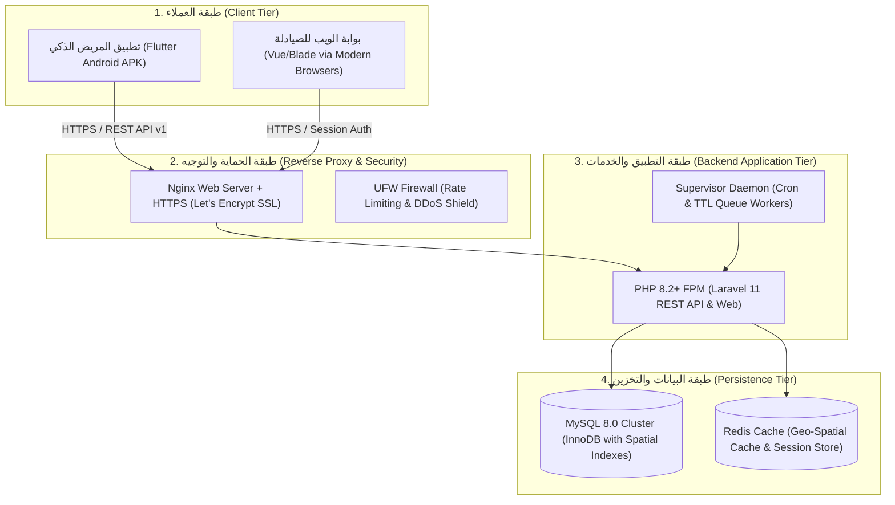

# دليل النشر والتشغيل السحابي لمشروع فارما-كونكت
## (PharmaConnect Production Deployment & Operations Manual)
**نظام خادم وعميل لتتبع وفرة الأدوية وإدارة المخزون متعدد الصيدليات**
*مقرر: خادم وعميل (Client-Server Systems) — المستوى الرابع*

---

## 1. المعمارية المادية لنشر النظام (Production Infrastructure Topology)

يعتمد نظام **PharmaConnect** معمارية نشر موزعة عالية التوافر ومؤمنة بالكامل:



---

## 2. متطلبات الخادم السحابي (Server Hardware & OS Prerequisites)

| المورد (Resource) | الحد الأدنى (Minimum Specs) | الموصى به للإنتاج (Recommended Specs) |
| :--- | :--- | :--- |
| **نظام التشغيل** | Ubuntu 22.04 LTS x64 | Ubuntu 24.04 LTS x64 |
| **المعالج (CPU)** | 2 vCPUs | 4 vCPUs (Intel Xeon / AMD EPYC) |
| **الذاكرة العشوائية (RAM)** | 4 GB | 8 GB |
| **التخزين (SSD/NVMe)** | 40 GB NVMe | 80 GB NVMe Enterprise |
| **حزمة الشبكة (Network)** | 100 Mbps Port | 1 Gbps Port مع IPv4 ثابت |

---

## 3. خطوات تجهيز الخادم السحابي (Linux Server Provisioning)

### 3.1 تحديث الحزم وتثبيت الأساسيات:
```bash
sudo apt update && sudo apt upgrade -y
sudo apt install -y curl git unzip ufw software-properties-common supervisor
```

### 3.2 تثبيت PHP 8.2 ومكتباته الضرورية:
```bash
sudo add-apt-repository ppa:ondrej/php -y
sudo apt update
sudo apt install -y php8.2-fpm php8.2-cli php8.2-mysql php8.2-curl php8.2-xml \
    php8.2-mbstring php8.2-zip php8.2-bcmath php8.2-intl php8.2-redis
```

### 3.3 تثبيت Composer:
```bash
curl -sS https://getcomposer.org/installer | sudo php -- --install-dir=/usr/local/bin --filename=composer
```

### 3.4 تثبيت وإعداد خادم MySQL 8.0:
```bash
sudo apt install -y mysql-server
sudo mysql_secure_installation
```
إنشاء قاعدة البيانات ومستخدم النظام:
```sql
CREATE DATABASE pharmaconnect CHARACTER SET utf8mb4 COLLATE utf8mb4_unicode_ci;
CREATE USER 'pharmaconnect_user'@'localhost' IDENTIFIED BY 'StrongP@ssw0rd2026!';
GRANT ALL PRIVILEGES ON pharmaconnect.* TO 'pharmaconnect_user'@'localhost';
FLUSH PRIVILEGES;
```

---

## 4. نشر وتكوين كود الخادم (Backend Deployment Process)

### 4.1 استنساخ المستودع وضبط الأذونات:
```bash
cd /var/www
sudo git clone https://github.com/jacobkhaled01-spec/PharmaConnect.git pharmaconnect
sudo chown -R www-data:www-data /var/www/pharmaconnect/backend/storage /var/www/pharmaconnect/backend/bootstrap/cache
sudo chmod -R 775 /var/www/pharmaconnect/backend/storage /var/www/pharmaconnect/backend/bootstrap/cache
```

### 4.2 تثبيت الاعتماديات وإعداد البيئة الإنتاجية:
```bash
cd /var/www/pharmaconnect/backend
composer install --no-dev --optimize-autoloader
cp .env.example .env
```

تعديل ملف `.env` الإنتاجي:
```ini
APP_NAME=PharmaConnect
APP_ENV=production
APP_DEBUG=false
APP_URL=https://pharmaconnect.ye

DB_CONNECTION=mysql
DB_HOST=127.0.0.1
DB_PORT=3306
DB_DATABASE=pharmaconnect
DB_USERNAME=pharmaconnect_user
DB_PASSWORD=StrongP@ssw0rd2026!

CACHE_STORE=database
SESSION_DRIVER=database
QUEUE_CONNECTION=database
```

توليد مفتاح التشفير وتشغيل التهجيرات والبذر:
```bash
php artisan key:generate
php artisan migrate --force --seed
php artisan storage:link
```

### 4.3 تفعيل تحسينات أداء الـ Caching في بيئة الإنتاج:
```bash
php artisan config:cache
php artisan route:cache
php artisan view:cache
php artisan event:cache
```

---

## 5. إعداد خادم الويب Nginx وتأمين SSL

### 5.1 إنشاء ملف التكوين `/etc/nginx/sites-available/pharmaconnect`:
```nginx
server {
    listen 80;
    server_name api.pharmaconnect.ye portal.pharmaconnect.ye;
    root /var/www/pharmaconnect/backend/public;

    add_header X-Frame-Options "SAMEORIGIN";
    add_header X-Content-Type-Options "nosniff";
    add_header X-XSS-Protection "1; mode=block";

    index index.php;
    charset utf-8;

    location / {
        try_files $uri $uri/ /index.php?$query_string;
    }

    location = /favicon.ico { access_log off; log_not_found off; }
    location = /robots.txt  { access_log off; log_not_found off; }

    error_page 404 /index.php;

    location ~ \.php$ {
        fastcgi_pass unix:/var/run/php/php8.2-fpm.sock;
        fastcgi_param SCRIPT_FILENAME $realpath_root$fastcgi_script_name;
        include fastcgi_params;
    }

    location ~ /\.(?!well-known).* {
        deny all;
    }
}
```

تفعيل الموقع وإعادة تشغيل Nginx:
```bash
sudo ln -s /etc/nginx/sites-available/pharmaconnect /etc/nginx/sites-enabled/
sudo nginx -t
sudo systemctl restart nginx
```

### 5.2 تأمين الاتصال بشهادة SSL مجانية عبر Certbot:
```bash
sudo apt install -y certbot python3-certbot-nginx
sudo certbot --nginx -d api.pharmaconnect.ye -d portal.pharmaconnect.ye
```

---

## 6. إعداد الجدولة ومراقبة الحجوزات المنتهية (Cron Job & Supervisor)

لمعالجة انتهاء صلاحية الحجوزات (TTL 30 دقيقة) بصورة لحظية ودورية، نضبط الجدولة التلقائية:

### 6.1 إضافة مشغل مهام Laravel إلى Cron:
```bash
sudo crontab -e -u www-data
```
إضافة السطر:
```cron
* * * * * cd /var/www/pharmaconnect/backend && php artisan schedule:run >> /dev/null 2>&1
```

---

## 7. بناء تطبيق الهاتف المحمول للإنتاج (Flutter Mobile APK Build)

لبناء نسخة الإنتاج النهائية القابلة للتثبيت على هواتف الأندرويد:

```bash
cd /path/to/PharmaConnect/frontend
flutter clean
flutter pub get
flutter build apk --release --split-per-abi
```

### مسار الملفات الناتجة (Release Artifacts):
- `frontend/build/app/outputs/flutter-apk/app-arm64-v8a-release.apk` (لهواتف الأندرويد الحديثة 64-bit)
- `frontend/build/app/outputs/flutter-apk/app-armeabi-v7a-release.apk` (للهواتف القديمة 32-bit)

---

## 8. خطة النسخ الاحتياطي واستعادة البيانات (Backup & Disaster Recovery)

يتم تشغيل سكريبت يومي لأخذ نسخة احتياطية مشفرة من قاعدة البيانات وتخزينها في خادم معزول:
```bash
#!/bin/bash
# Backup Script: /usr/local/bin/pharmaconnect-backup.sh
DATE=$(date +%Y%m%d_%H%M%S)
BACKUP_DIR="/var/backups/pharmaconnect"
mkdir -p $BACKUP_DIR

mysqldump -u pharmaconnect_user -p'StrongP@ssw0rd2026!' pharmaconnect | gzip > $BACKUP_DIR/db_$DATE.sql.gz
find $BACKUP_DIR -type f -mtime +14 -name "*.sql.gz" -exec rm {} \;
```
