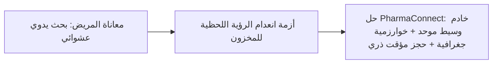
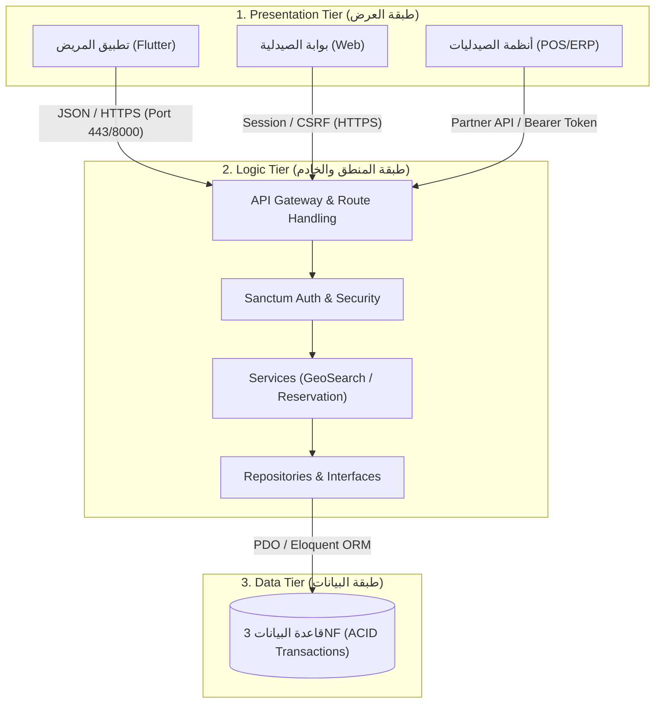
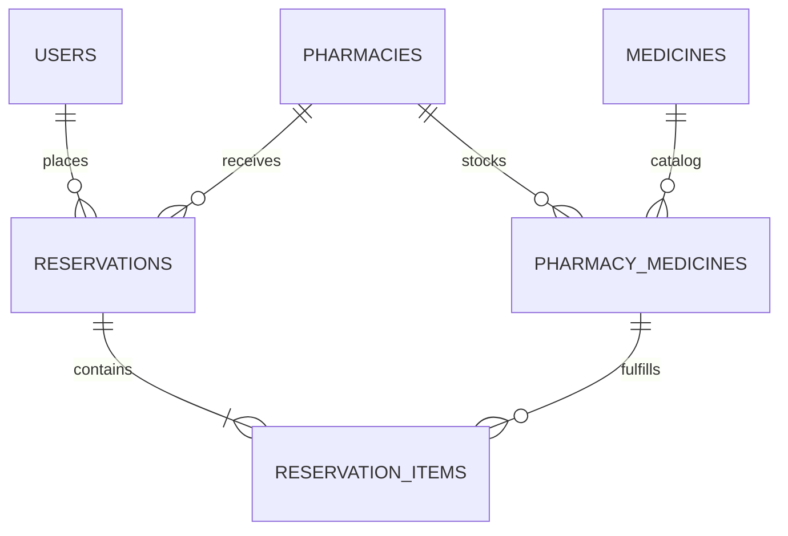
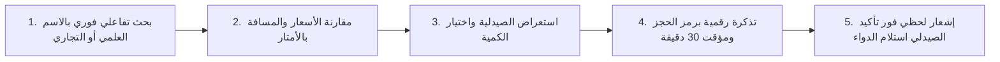
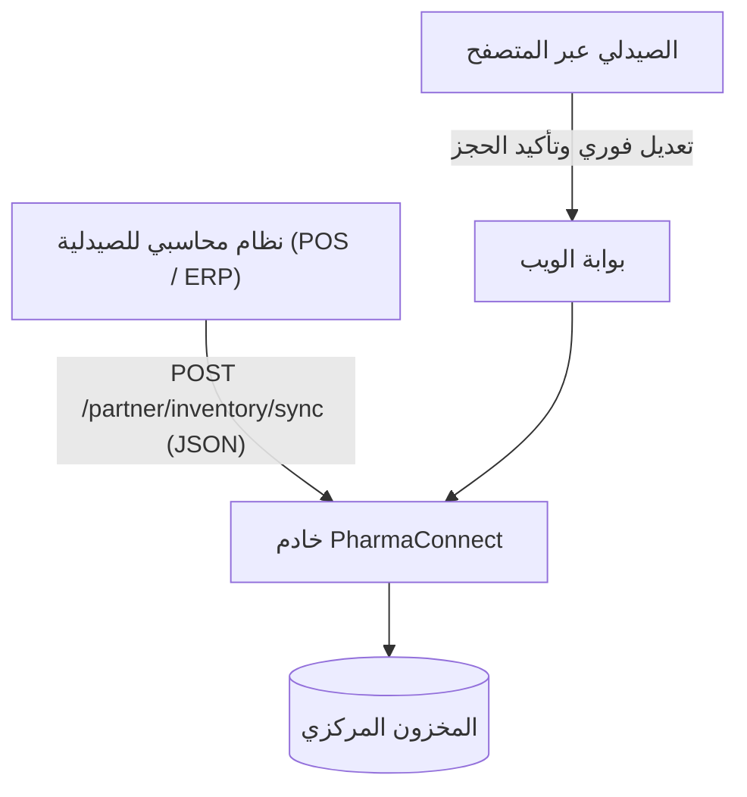
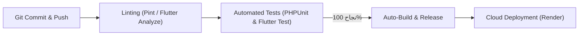

# 🎯 العرض التقديمي الأكاديمي المختصر لمشروع فارما-كونكت
## (PharmaConnect: Academic Defense Slides Deck)
**مشروع نظام تتبع وفرة الأدوية وإدارة المخزون متعدد الصيدليات**  
*مقرر بنية وبرمجة أنظمة الخادم والعميل (Client-Server Systems) — المستوى الرابع*

---

## فهرس شرائح العرض التقديمي (10 شرائح — 12 دقيقة)

| الشريحة | العنوان | المسؤول المتحدث | المدة المقترحة |
| :---: | :--- | :---: | :---: |
| **01** | [واجهة المشروع وبيانات الفريق](#slide-01) | المتحدث 1 | دقيقة واحدة |
| **02** | [المشكلة الواقعية والدوافع](#slide-02) | المتحدث 1 | دقيقة واحدة |
| **03** | [المعمارية الموزعة ثلاثية الطبقات (3-Tier)](#slide-03) | المتحدث 1 | دقيقة ونصف |
| **04** | [هندسة البيانات والخادم المركزي (Backend & 3NF)](#slide-04) | المتحدث 1 | دقيقة ونصف |
| **05** | [قفل التزامن وخوارزمية هافرسين (Concurrency & Math)](#slide-05) | المتحدث 1 | دقيقة ونصف |
| **06** | [عميل الهاتف المحمول (Flutter & Clean Architecture)](#slide-06) | المتحدث 2 | دقيقتان |
| **07** | [بوابة الويب والربط المحاسبي (Pharmacy Portal & B2B)](#slide-07) | المتحدث 3 | دقيقة ونصف |
| **08** | [ضمان الجودة والاختبارات التلقائية (CI/CD Pipelines)](#slide-08) | المتحدث 3 | دقيقة واحدة |
| **09** | [سيناريو العرض العملي الحي (Interactive Live Demo)](#slide-09) | كامل الفريق | دقيقتان |
| **10** | [الخاتمة والتوصيات المستقبلية وأسئلة اللجنة](#slide-10) | كامل الفريق | دقيقة واحدة |

---

<a name="slide-01"></a>
## الشريحة 1: بطاقة المشروع وهوية الفريق

### 🖥️ محتوى الشريحة (Visual Content)
- **اسم النظام:** فارما-كونكت (PharmaConnect)
- **الوصف الأكاديمي:** نظام خادم وعميل موزع لتتبع وفرة الأدوية الحيوية، إدارة المخزون متعدد الصيدليات، والحجز المؤقت المتزامن.
- **التقنيات الأساسية:**
  - **الخادم المركزي:** PHP 8.2+ / Laravel 11 (RESTful APIs + Sanctum Authentication).
  - **تطبيق العميل:** Flutter 3.x / Dart (Cross-Platform Mobile Client).
  - **قاعدة البيانات:** Relational Database (3NF Architecture) مع محرك معاملات ذري.
  - **بوابة الصيدليات:** Responsive Web Blade Engine & Tailwind-Engineered Design.

---

### 🎙️ نص إلقاء المتحدث (Speaker Script — 60 ثانية)
> "بسم الله الرحمن الرحيم، والصلاة والسلام على رسول الله.  
> مرحباً بكم في العرض التقني المباشر لنظام فارما-كونكت (PharmaConnect).  
> يمثل هذا النظام منصة موزعة متقدمة لتتبع وفرة الأدوية الحيوية وإدارة المخزون متعدد الصيدليات بالحجز المتزامن، حيث يجسد تطبيقاً عملياً صارماً لمعمارية 3-Tier Distributed Systems من خلال دمج خادم مركزي متين وخفيف بإطار عمل Laravel 11، وعميل هاتف لحظي للمرضى بإطار عمل Flutter 3، مع بوابة ويب متكاملة لإدارة المخزون والربط المحاسبي B2B."

---

<a name="slide-02"></a>
## الشريحة 2: المشكلة الواقعية والدوافع الهندسية

### 🖥️ محتوى الشريحة (Visual Content)
- **أزمة البحث اليدوي العشوائي:** هدر ما بين 45 إلى 120 دقيقة للبحث عن دواء طارئ في شوارع المدينة.
- **تشتت بيانات المخزون:** الصيدليات تعمل كـ "جزر منعزلة" بأنظمة محاسبية متباينة دون ربط مركزي.
- **مشكلة الاتصال الكاذب:** تأكيد توفر الدواء هاتفياً ثم بيعه لعميل آخر قبل وصول المريض.
- **أهداف النظام التقنية:**
  1. استعلام لحظي عن الصيدليات المتاحة حول المريض مرتبة حسب الأقرب جغرافياً.
  2. حجز مؤقت عادل (30 دقيقة TTL) يضمن حماية حق المريض في الوصول وحق الصيدلي في تصريف دوائه.
  3. حماية المخزون من الحجز المزدوج (Zero Race-Conditions).



---

### 🎙️ نص إلقاء المتحدث (Speaker Script — 60 ثانية)
> "حضرات الأساتذة، المشكلة التي تصدينا لها ليست مجرد تطبيق لعرض المنتجات، بل هي معضلة إنسانية وهندسية في آن واحد. المريض في بلادنا عندما يحتاج دواءً حرجاً يضطر للطواف على عشرات الصيدليات سيراً أو عبر المواصلات. وحتى في حال الاتصال هاتفياً، قد يصل ليجد أن الدواء بيع قبل لحظات!  
> لذا كان دافعنا بناء بنية خادم وعميل ذكية تتيح للمريض البحث بالاسم التجاري أو العلمي، ومعرفة أقرب صيدلية متوفر لديها الدواء، وحجزه لمدة 30 دقيقة مع قفل حقيقي للمخزون يمنع بيعه لأي شخص آخر حتى وصوله."

---

<a name="slide-03"></a>
## الشريحة 3: المعمارية الموزعة ثلاثية الطبقات (3-Tier Architecture)

### 🖥️ محتوى الشريحة (Visual Content)
- **طبقة العرض (Presentation Tier):**
  - تطبيق هاتف المريض (Flutter Client).
  - بوابة إدارة الصيدليات المركزية (Web Portal Blade).
  - نقاط البيع وأنظمة الكاشير (B2B Partner Systems).
- **طبقة منطق الأعمال والخدمات (Application / Logic Tier):**
  - Laravel 11 RESTful API Gateway.
  - محركات الخدمات المستقلة: `GeoSearchService`, `ReservationService`, `AuthService`.
  - نمط المستودعات والتجريد: `Repository Pattern` (عزل الاستعلامات عن المنطق).
- **طبقة البيانات (Data Tier):**
  - قاعدة بيانات علائقية موثوقة (3NF Relational DB).
  - دعم المعاملات الذرية وقفل الصفوف (ACID Transactions & InnoDB Row-Locks).



---

### 🎙️ نص إلقاء المتحدث (Speaker Script — 90 ثانية)
> "هنا يكمن جوهر مقررنا (خادم وعميل). لم نقم بربط العميل بقاعدة البيانات مباشرة كما في المعماريات الثنائية الساذجة (2-Tier) لأن ذلك يمثل انتحاراً أمنياً ويعطل قابلية التوسع.  
> اعتمدنا معمارية 3-Tier Distributed بالكامل: فالعميل سواء كان تطبيق Flutter أو متصفح الويب يتواصل حصراً عبر طلبات Stateless RESTful API خفيفة بصيغة JSON.  
> تتولى الطبقة الوسطى (Laravel Logic Tier) تطبيق كافة قواعد الأعمال: التحقق من التشفير بـ Sanctum، حساب المسافات، وتطبيق المعاملات الذرية، ثم التخاطب مع طبقة البيانات المنفصلة تماماً، مما يتيح التوسع الأفقي وتغيير قاعدة البيانات دون لمس سطر واحد في تطبيق العميل."

---

<a name="slide-04"></a>
## الشريحة 4: هندسة البيانات والخادم المركزي (Database & Backend Engineering)

### 🖥️ محتوى الشريحة (Visual Content)
- **7 جداول رئيسية في الشكل المعياري الثالث (Third Normal Form - 3NF):**
  1. `users`: إدارة هويات المرضى، مدراء الصيدليات، والمشرفين (RBAC).
  2. `pharmacies`: بيانات الصيدلية، الهاتف، والإحداثيات الجغرافية (`latitude`, `longitude`).
  3. `medicines`: السجل القومي الموحد للأدوية (الاسم العلمي، التجاري، الشكل والتركيز).
  4. `pharmacy_medicines`: جدول الوساطة للربط وإدارة الكمية والسعر لكل صيدلية.
  5. `reservations`: تذاكر الحجز، الرمز الفريد، والمؤقت الزمني وحالة الحجز.
  6. `reservation_items`: تفاصيل أصناف الحجز والأسعار المحسوبة لحظة الحجز.
  7. `personal_access_tokens`: توكنات المصادقة المشفرة (Laravel Sanctum).
- **التكامل المرجعي الصارم:** استخدام المفاتيح الأجنبية `Foreign Keys` مع قيود الحذف والتعديل (`Cascade/Restrict`).



---

### 🎙️ نص إلقاء المتحدث (Speaker Script — 90 ثانية)
> "في هندسة قاعدة البيانات، حرصنا على تحقيق أعلى معايير الـ Normalization (3NF).  
> لم نقم بتكرار بيانات الأدوية (كالاسم العلمي، الشركة المصنعة، والشكل الدوائي) داخل كل صيدلية؛ بل أنشأنا سجلاً موحداً في جدول `medicines`، وجعلنا جدول `pharmacy_medicines` هو نقطة الوصل التي تحمل الكمية الحالية والسعر المحدد لكل صيدلية على حدة.  
> كما صممنا جدول `reservations` ليعمل بنظام الحالات الخمس المغلقة: (`pending` قيد الانتظار، `confirmed` مؤكد، `completed` تم الاستلام، `cancelled` ملغي، و `expired` منتهي الصلاحية)، مما يضمن عدم حدوث أي تناقض أو حجز يتيم في النظام."

---

<a name="slide-05"></a>
## الشريحة 5: قفل التزامن وخوارزمية هافرسين الرياضية (Concurrency & Math)

### 🖥️ محتوى الشريحة (Visual Content)
- **1. معضلة البيع المزدوج والـ Race Condition:**
  - مشكلة تنافس مريضين على حجز آخر عبوة متبقية في نفس الجزء من الثانية.
  - **الحل الهندسي:** القفل التشاؤمي على مستوى الصف (`Pessimistic Row-Level Lock`):
  ```php
  DB::transaction(function () use ($stockId, $quantity) {
      $stock = PharmacyMedicine::where('id', $stockId)->lockForUpdate()->first();
      if ($stock->available_quantity < $quantity) {
          throw new Exception('الكمية المطلوبة لم تعد متوفرة حالياً.');
      }
      $stock->decrement('available_quantity', $quantity);
      // إنشاء الحجز وضبط مؤقت الـ 30 دقيقة
  });
  ```
- **2. خوارزمية هافرسين لحساب المسافة الكروية (Haversine Formula):**
  $$d = 2R \cdot \arcsin\left(\sqrt{\sin^2\left(\frac{\Delta \phi}{2}\right) + \cos(\phi_1)\cos(\phi_2)\sin^2\left(\frac{\Delta \lambda}{2}\right)}\right)$$
  - قياس المسافة بدقة متناهية على سطح كروي مع أخذ نصف قطر الأرض ($R = 6371\text{ km}$).
  - ترتيب نتائج البحث من الأقرب جغرافياً للمريض دون الحاجة لأي مفاتيح أو اشتراكات خارجية.

---

### 🎙️ نص إلقاء المتحدث (Speaker Script — 90 ثانية)
> "هذه الشريحة تمثل الدقة العلمية للمشروع. واجهنا تحديين حاسمين:  
> الأول: كيف نمنع مريضين من حجز آخر علبة دواء إذا ضغطا على الزر في نفس الجزء من الثانية؟ لم نعتمد على التحقق البسيط من الـ Cache أو الشاشات؛ بل استخدمنا القفل التشاؤمي الصارم `lockForUpdate()` داخل معاملة ذرية `DB::transaction()`. محرك قاعدة البيانات InnoDB يضع قفلاً حصرياً على الصف فور دخول الطلب الأول، فيتم خصم العلبة، وحين يُفك القفل ويدخل الطلب الثاني يجد الرصيد صفر فيُرفض فورياً بأمان بنسبة خطأ 0%.  
> الثاني: حساب المسافة الواقعية؛ لم نستخدم معادلة المسافة الإقليدية البسيطة لأن الأرض كروية، بل نفذنا خوارزمية هافرسين رياضياً داخل المستودع، لحساب البعد الدقيق بالكيلومتر وترتيب الصيدليات من الأقرب فورياً."

---

<a name="slide-06"></a>
## الشريحة 6: تطبيق الهاتف المحمول وتجربة المريض (Flutter Mobile Client)

### 🖥️ محتوى الشريحة (Visual Content)
- **معمارية الكود النظيف (Clean Architecture):**
  - طبقة `core`: إدارة خدمات الشبكة `ApiService`، خدمة الموقع `LocationService`، وثيمات التصميم.
  - طبقة `data`: نماذج البيانات الذكية `Models` مع التحويل الآمن `fromJson` وتنسيق التواريخ.
  - طبقة `presentation`: الشاشات والويدجتس الموجهة للمريض مع عزل كامل لحالة التطبيق.
- **خصائص تجربة المستخدم الطبية (Medical UI/UX System):**
  - الألوان الطبية المعتمدة عالمياً: الأخضر الزمردي (`#059669` / `#10B981`) مع الأبيض الصافي.
  - بطاقة الحجز التفاعلية مع الباركود وكود الحجز السريع ومؤقت العد التنازلي الحي.
  - خريطة تفاعلية كاملة للمسار تعتمد على مربعات `CartoDB / OpenStreetMap` المباشرة دون مفاتيح تجارية.
  - دعم كامل للغة العربية (RTL) ومعايير سهولة الوصول WCAG.



---

### 🎙️ نص إلقاء المتحدث (Speaker Script — 120 ثانية)
> "أهلاً بكم. بصفتي مسؤول عميل الهاتف المحمول، بنينا التطبيق بإطار عمل Flutter بلغة Dart ليعمل بكفاءة عالية على منصات متعددة.  
> صممنا هيكلية التطبيق وفق معمارية Clean Architecture؛ حيث عزلنا منطق الشبكة داخل `ApiService` بنمط Singleton، مما يتيح إدارة الجلسات واحتجاز التوكنات وتوفير ميزة المرونة (Resilience) والعمل حتى في ظروف ضعف الاتصال.  
> واجهة المستخدم تعتمد نظام التصميم الطبي المريح (Emerald Medical Palette). عندما يختار المريض الدواء ويؤكد الحجز، تنبثق له تذكرة رقمية أنيقة تحوي كود الحجز السريع ورمز الاستجابة السريعة QR، مع مؤقت عد تنازلي حي يبدأ من 30 دقيقة.  
> كما تم ربط الشاشة بمزامنة خلفية تستشعر تلقائياً لحظة تأكيد الصيدلي لاستلام الدواء في لوحة الويب، فتتحول التذكرة لحظياً وبشكل نابض إلى شارة النجاح الخضراء مع تنبيه اهتزازي."

---

<a name="slide-07"></a>
## الشريحة 7: بوابة الويب والربط المحاسبي (Pharmacy Portal & B2B)

### 🖥️ محتوى الشريحة (Visual Content)
- **بوابة الويب المتكاملة للصيدليات (Web Inventory Portal):**
  - مصممة بنمط متجاوب ومحمي بآليات الجلسات ومكافحة التزوير (CSRF Protection).
  - تمكين الصيدلي من تعديل الأسعار، ومراقبة المخزون الحرج (Low Stock Alert).
  - استقبال طلبات الحجز لحظياً مع ميزة التحديث التلقائي الحي (Live Polling كل 5 ثوانٍ).
  - تأكيد تسليم الدواء والمحاسبة بضغطة زر وتحديث حالة النظام فوراً.
- **بوابة الربط البرمجي بين الأنظمة (B2B Partner Integration API):**
  - تمكين أنظمة الصيدليات المحاسبية القائمة (كـ يمن سوفت، الإبداع، أو المتكامل) من التزامن الآلي.
  - واجهات `/api/v1/partner/inventory/sync` لتحديث مئات الأصناف في طلب واحد.
  - واجهات `/api/v1/partner/reservations/{id}/fulfill` للتأكيد عبر أجهزة الكاشير وماسحات الباركود.



---

### 🎙️ نص إلقاء المتحدث (Speaker Script — 90 ثانية)
> "لتطبيق مفهوم الشمولية في بيئات الأعمال، قمنا بإنشاء قناتين رئيسيتين لإدارة المخزون:  
> القناة الأولى: بوابة ويب خفيفة وسريعة يستطيع الصيدلي فتحها من هاتفه أو كمبيوتر الصيدلية، يستعرض من خلالها الحجوزات الواردة لحظياً، مع مؤقت مزامنة حية يقوم بتحديث الجدول تلقائياً كل 5 ثوانٍ دون الحاجة للضغط على F5.  
> القناة الثانية: وهي الأهم هندسياً، بوابة B2B Integration API المخصصة لربط أنظمة الصيدليات المحاسبية القائمة كأنظمة نقاط البيع؛ حيث يستطيع نظام الكاشير إرسال طلب آلي للمزامنة أو تأكيد صرف الحجز بمجرد مسح الباركود، مما يدمج نظامنا بسلاسة مع الواقع العملي للصيدليات."

---

<a name="slide-08"></a>
## الشريحة 8: ضمان الجودة والاختبارات التلقائية (QA & CI/CD Pipelines)

### 🖥️ محتوى الشريحة (Visual Content)
- **دورة حياة هندسة البرمجيات المحكمة (Looping Engineering Workflow):**
  - التخطيط $\rightarrow$ التنفيذ $\rightarrow$ الاختبار التلقائي $\rightarrow$ التدقيق $\rightarrow$ التوثيق اللحظي في `CHANGELOG.md`.
- **خطوط أنابيب التكامل المستمر الآلية (GitHub Actions CI/CD):**
  - فحص التنسيق والجودة بـ **Laravel Pint** لكود PHP بنسبة نظافة 100%.
  - فحص وتحليل كود Dart بـ **Flutter Analyze** دون أي أخطاء أو تحذيرات.
  - تنفيذ الاختبارات الآلية التلقائية بنجاح تام:
    - **12 اختبار تكاملي وظيفي (Feature & Unit Tests)** في الباك إند تغطي: البحث الجغرافي، قفل التزامن، مسارات B2B، وعزل حجوزات المستخدمين.
    - اختبارات الـ Models والـ Widget Flow في Flutter.
  - النشر التلقائي للإنتاج على السحابة (Cloud Hosting on Render).



---

### 🎙️ نص إلقاء المتحدث (Speaker Script — 60 ثانية)
> "في هذا المشروع، لم نترك شيئاً للصدفة أو التجربة اليدوية. طبقنا معايير الشركات العالمية عبر خط أنابيب CI/CD متكامل على GitHub Actions.  
> عند كل تعديل للكود، تعمل سيرفرات GitHub تلقائياً لفحص التنسيق بـ Laravel Pint و Flutter Analyze، ثم تشغيل حزمة اختبارات برمجية مؤتمتة بنسبة نجاح 100%، للتأكد من أن قفل التزامن، وعزل بيانات المرضى، وحساب المسافات يعمل بدون أي خطأ. وفور اجتياز الفحص، يتم نشر التحديثات تلقائياً إلى الخادم السحابي الحي."

---

<a name="slide-09"></a>
## الشريحة 9: سيناريو العرض العملي الحي (Interactive Live Demo Sequence)

### 🖥️ محتوى الشريحة (جدول الخطوات العملية أمام اللجنة)

| الخطوة | المنصة المشغلة | الإجراء أمام أعضاء اللجنة | النتيجة المشاهدة على الشاشة |
| :---: | :--- | :--- | :--- |
| **1** | المتصفح (بوابة الويب) | تسجيل دخول الصيدلي وتعديل مخزون **Norvasc** إلى 10 علب. | حفظ فوري ورسالة نجاح في قاعدة البيانات. |
| **2** | تطبيق الهاتف (Flutter) | كتابة "Norvasc" في حقل البحث التفاعلي. | ظهور الصيدلية بالسعر الدقيق، الكمية (10)، والمسافة بالكيلومتر. |
| **3** | تطبيق الهاتف | اختيار حجز عبوة واحدة وإدخال اسم ورقم المريض ثم تأكيد الحجز. | توليد تذكرة رقمية فورية بمؤقت تنازلي (29:59 دقيقة) وباركود فريد. |
| **4** | المتصفح (بوابة الويب) | التحديث التلقائي يظهر الحجز الجديد في جدول الحجوزات الواردة. | خصم المخزون فورياً من 10 إلى 9 في قاعدة البيانات. |
| **5** | المتصفح | الصيدلي يضغط على زر "تم التسليم والمحاسبة". | تحول الحالة فوراً إلى `completed`. |
| **6** | تطبيق الهاتف | شاشة التذكرة المفتوحة بيد المريض تلتقط التأكيد آلياً. | توقف المؤقت وظهور شارة النجاح الزمردية "تم استلام الدواء بنجاح والمحاسبة ✓". |

---

### 🎙️ نص إلقاء الفريق (Speaker Script — 120 ثانية)
> "والآن، سننتقل مع لجنتنا الموقرة إلى العرض العملي الحي المشترك.  
> أمامكم على الشاشة اليمنى متصفح الصيدلية، وعلى الشاشة اليسرى هاتف العميل يعملان في بيئة متزامنة حية.  
> لاحظوا معي: الصيدلي يعدل سعر وكمية الدواء... فورا في تطبيق المريض يظهر التعديل دون أي تأخير.  
> الآن يقوم المريض بالحجز... تخرج التذكرة ويبدأ مؤقت الـ 30 دقيقة، وبنفس الثانية يظهر الطلب في شاشة الصيدلي وينخفض المخزون المتاح.  
> وأخيراً، يضغط الصيدلي 'تم التسليم والمحاسبة'، لتتحول شاشة هاتف المريض تلقائياً ولحظياً إلى شارة الاستلام الخضراء المكتملة. هذا هو التكامل الحقيقي لأنظمة الخادم والعميل."

---

<a name="slide-10"></a>
## الشريحة 10: الخاتمة والتوصيات المستقبلية (Conclusion & Future Scope)

### 🖥️ محتوى الشريحة (Visual Content)
- **أهم المنجزات المحققة:**
  - بناء نظام خادم وعميل متكامل 3-Tier يربط بين المرضى، الصيدليات، والمشرفين.
  - خوارزمية هافرسين محلية لحساب المسافات الجغرافية الدقيقة دون تكاليف خارجية.
  - قفل تشاؤمي صارم يمنع التنافس والبيع المزدوج بنسبة خطأ 0%.
  - تطبيق هاتف سريع، ذكي، ومرن يتعامل مع انقطاع الإنترنت بنمط الـ Resilience.
  - خط أنابيب CI/CD تلقائي يضمن خلو المشروع من أي تحذيرات أو ثغرات برمجية.
- **التوصيات وآفاق التطوير المستقبلي:**
  - إضافة ميزة الدفع الإلكتروني المسبق عبر المحافظ الرقمية اليمنية (فلوسك، جوالي، كاش).
  - دمج خدمة توصيل الأدوية للمنازل (Pharmacy Delivery Fleet Management).
  - تطبيق الذكاء الاصطناعي في التنبؤ بنفاد الأدوية الحرجة وتوجيه سلاسل الإمداد.

---

### 🎙️ نص إلقاء المتحدث (Speaker Script — 60 ثانية)
> "في ختام عرضنا، نؤكد أن مشروع **PharmaConnect** يمثل رؤية هندسية ناضجة لكيفية توظيف تقنيات الخادم والعميل لخدمة القطاع الصحي والمجتمعي بكفاءة وموثوقية عالية.  
> نشكر لأساتذتنا الكرام حسن استماعهم وتوجيهاتهم القيمة التي كانت السند في إنجاز هذا العمل بالصورة التي تليق بجامعتنا، ونحن الآن على أتم الاستعداد لسماع ملاحظاتكم والإجابة على كافة أسئلتكم البرمجية والمعمارية.  
> والسلام عليكم ورحمة الله وبركاته."

---

## ⚡ ملحق سريع: بطاقة الإسعاف في جيب المتحدث (Pocket QA Guide)

| السؤال المتوقع من الدكتور | الإجابة في جملة واحدة حاسمة | أين تفتح الكود لإثباتها؟ |
| :--- | :--- | :--- |
| **أين منعتم الـ Race Condition؟** | "داخل دالة `createReservation` عبر `lockForUpdate()` مع `DB::transaction()`." | [`ReservationService.php`](file:///d:/IT%20FILES/level%204/خادم%20وعميل/مشروع%20الصيدلية/backend/app/Services/ReservationService.php) |
| **أين كود حساب المسافة الكروية؟** | "في دالة `calculateHaversineDistance()` باستخدام نصف قطر الأرض 6371 كم." | [`EloquentMedicineRepository.php`](file:///d:/IT%20FILES/level%204/خادم%20وعميل/مشروع%20الصيدلية/backend/app/Repositories/Eloquent/EloquentMedicineRepository.php) |
| **كيف يعمل الأمان بدون Session في الموبايل؟** | "عبر بروتوكول `Bearer Token` المشفر الصادر من حزمة Laravel Sanctum." | [`AuthController.php`](file:///d:/IT%20FILES/level%204/خادم%20وعميل/مشروع%20الصيدلية/backend/app/Http/Controllers/Api/V1/AuthController.php) |
| **أين معمارية الـ Clean Architecture؟** | "مقسمة لطبقات `core`, `data`, `presentation` داخل مجلد `lib` في Flutter." | مجلد [`frontend/lib`](file:///d:/IT%20FILES/level%204/خادم%20وعميل/مشروع%20الصيدلية/frontend/lib) |
| **ما الذي يثبت جودة الكود قبل تسليمه؟** | "اجتياز 12 اختبار PHPUnit بنجاح وخلو كود Dart من أي تحذيرات بـ Flutter Analyze." | التيرمنال عبر `php artisan test` |
