# وثيقة مواصفات متطلبات النظام البرمجية (Software Requirements Specification - SRS)
**مشروع:** فارما-كونكت (PharmaConnect) - منصة موزعة لتتبع وفرة الأدوية وإدارة المخزون متعدد الصيدليات  
**المقرر:** خادم وعميل (Client-Server Architecture) - المستوى الرابع  
**المعيار:** متوافق مع معايير IEEE Std 830-1998 وتوثيق APA 7th Edition  
**التاريخ:** 2026-09-18  
**النسخة:** 1.0 (معتمدة)  

---

## 1. المقدمة (Introduction)

### 1.1 الغرض من الوثيقة (Purpose)
تهدف هذه الوثيقة إلى تقديم توصيف شامل ودقيق لكافة المتطلبات الوظيفية (Functional) وغير الوظيفية (Non-Functional) والقيود الهندسية والمعمارية لنظام **فارما-كونكت (PharmaConnect)**. تُعد هذه الوثيقة العقد الهندسي الأساسي والمرجع الموجه لجميع مراحل التصميم البرمجي (Design)، والتطوير (Implementation)، والاختبار وضمان الجودة (Quality Assurance).

### 1.2 نطاق النظام (Scope)
نظام **PharmaConnect** هو منصة برمجية موزعة تعتمد معمارية الخادم والعميل (Client-Server Architecture) لمعالجة مشكلة تجزؤ بيانات المخزون الدوائي وعزلة الصيدليات. يوفر النظام:
1. **بوابة ويب لإدارة المخزون (Multi-Tenant Web Portal):** تُمكّن الصيدليات المسجلة من إدخال أصناف الأدوية، تحديث الكميات، تحديد الأسعار وحالات التوفر، واستقبال طلبات الحجز.
2. **خادم واجهات برمجية موحدة (Centralized RESTful API Backend):** مبني بإطار عمل Laravel لإدارة المنطق المشترك، حماية العمليات المتزامنة (Concurrency Control)، وإدارة مؤقتات الحجز المؤقت (TTL).
3. **تطبيق عميل الهواتف الذكية (Flutter Mobile Client):** يُمكّن المرضى والمراجعين من البحث اللحظي الجغرافي عن الأدوية وبدائلها والتعرف على أقرب الصيدليات المتوفر بها الصنف وإجراء حجز مؤقت مؤكد.

### 1.3 التعريفات والمصطلحات والاختصارات (Definitions & Acronyms)
| المصطلح / الاختصار | الوصف والتعريف التقني |
|---|---|
| **SRS** | مواصفات متطلبات النظام البرمجية (Software Requirements Specification). |
| **Client-Server** | نمط معماري يوزع المهام بين موفري الموارد أو الخدمات (الخادم) وطالبي الخدمة (العملاء). |
| **RESTful API** | واجهة برمجة تطبيقات تعتمد بروتوكول HTTP ومعايير نقل الحالة التمثيلية بتنسيق JSON. |
| **Multi-Tenancy** | بنية برمجية تسمح لمستأجرين متعددين (الصيدليات) بمشاركة نفس الخادم مع عزل منطقي للبيانات. |
| **TTL (Time-To-Live)** | مدة صلاحية الحجز المؤقت قبل إلغائه آلياً وإعادة الدواء لمخزون الصيدلية المتاح. |
| **Concurrency Control** | التحكم بالعمليات المتزامنة لمنع التعارض عند محاولة حجز نفس الصنف في أجزاء من الثانية. |
| **Geolocation API** | واجهة برمجة تطبيقات لحساب الإحداثيات الجغرافية والمسافات المكانية بين العميل والصيدلية. |

---

## 2. الوصف العام للنظام (Overall Description)

### 2.1 منظور المنتج ومعمارية النظام (Product Perspective)
يعمل النظام كمنظومة متعددة العملاء (Multi-Client System) متصلة بخادم مركزي وقاعدة بيانات مشتركة:
- **عميل الويب (Web Client):** واجهات مخصصة لأصحاب ومدراء الصيدليات تعمل عبر المتصفحات.
- **عميل الهاتف (Mobile Client):** تطبيق Flutter للمرضى يعمل على أنظمة Android و iOS.
- **الخادم المركزي (Central Server):** تطبيق Laravel متصل بقاعدة بيانات MySQL وذاكرة تخزين مؤقت Redis.

### 2.2 فئات المستخدمين وخصائصهم (User Classes & Characteristics)
1. **المريض / العميل (Patient / Consumer):**
   - يبحث عن الأدوية النادرة أو الضرورية.
   - يحتاج إلى تجربة مستخدم سريعة جداً، خالية من التعقيد، تظهر له الصيدلية الأقرب والأنسب سعراً.
2. **الصيدلي / مدير فرع الصيدلية (Pharmacist / Tenant User):**
   - يدير مخزون الأدوية في الصيدلية (إضافة أصناف، تعديل كميات وأسعار، متابعة نواقص).
   - يستقبل طلبات الحجز ويؤكد تسليم الدواء للعميل عند حضوره.
3. **مشرف النظام العام (System Administrator):**
   - يدير تراخيص وحسابات الصيدليات الجديدة على المنصة لضمان الموثوقية القانونية والطبية.
   - يراقب الأداء الإحصائي ووفرة الأدوية الحيوية.

### 2.3 القيود التصميمية والتنفيذية (Design Constraints)
- **لغات البرمجة وأطر العمل:** PHP 8.2+ (Laravel 11.x) للخادم، Dart 3.x (Flutter 3.x) للموبايل.
- **بروتوكولات الأمان:** تشفير الاتصال بالكامل عبر HTTPS و SSL/TLS، وتأمين واجهات الـ API باستخدام Bearer Tokens (Laravel Sanctum).
- **قواعد البيانات:** الاعتماد على معايير قواعد البيانات العلائقية (RDBMS) مع دعم المعاملات الذرية (ACID Transactions).
- **الهوية البصرية:** التقيد الصارم بنظام التصميم الطبي المعتمد (الأخضر الزمردي `#059669` والأبيض الصافي `#FFFFFF`).

---

## 3. مخطط حالات الاستخدام (UML Use Case Diagram)

```mermaid
graph TD
    subgraph "جهات التفاعل الخارجية (Actors)"
        Patient["المريض / العميل (Patient)"]
        Pharmacist["الصيدلي (Pharmacist)"]
        Admin["مشرف النظام (System Admin)"]
    end

    subgraph "نظام فارما-كونكت (PharmaConnect System)"
        UC1["تسجيل الدخول وإدارة الحساب (Login & Auth)"]
        UC2["البحث عن دواء واستعلام التوفر (Search Medicines)"]
        UC3["عرض الصيدليات الأقرب والمسافة (View Nearby Pharmacies)"]
        UC4["إجراء حجز مؤقت للدواء (Make Temporary Reservation)"]
        UC5["متابعة حالة الحجز ومؤقت الـ TTL (Track Reservation)"]
        UC6["إدارة مخزون الأدوية (Manage Medicine Stock)"]
        UC7["تحديث الأسعار وحالة التوفر (Update Price & Availability)"]
        UC8["استقبال وتأكيد طلبات الحجز (Confirm Reservation Pickup)"]
        UC9["اعتماد وتوثيق الصيدليات الجديدة (Approve Pharmacies)"]
        UC10["التقارير والإحصائيات العامة (System Analytics)"]
    end

    Patient --> UC1
    Patient --> UC2
    Patient --> UC3
    Patient --> UC4
    Patient --> UC5

    Pharmacist --> UC1
    Pharmacist --> UC6
    Pharmacist --> UC7
    Pharmacist --> UC8

    Admin --> UC1
    Admin --> UC9
    Admin --> UC10
```

---

## 4. المتطلبات الوظيفية التفصيلية (Detailed Functional Requirements)

### 4.1 وحدة المصادقة وإدارة الحسابات (Authentication Module - AUTH)
* **REQ-AUTH-01:** يجب أن يتيح النظام تسجيل حساب جديد للمريض عبر تطبيق الموبايل بواسطة (الاسم، رقم الهاتف، كلمة المرور).
* **REQ-AUTH-02:** يجب أن يتيح النظام تسجيل حساب للصيدلية مع إرفاق (اسم الصيدلية، رقم الترخيص، العنوان، الإحداثيات الجغرافية Lat/Lng، ورقم هاتف الصيدلي).
* **REQ-AUTH-03:** يجب تشفير كلمات المرور باستخدام خوارزميات التجزئة الآمنة (Bcrypt).
* **REQ-AUTH-04:** يجب توفير آلية مصادقة قائمة على الرموز الرقمية الآمنة (API Tokens عبر Laravel Sanctum) لتطبيق الهاتف، وجلسات آمنة (Web Sessions) لبوابة الويب.

### 4.2 وحدة إدارة مخزون الصيدليات (Pharmacy Inventory Module - INV)
* **REQ-INV-01:** يجب أن يتمكن الصيدلي من استعراض الفهرس العام للأدوية وإضافة أي صنف إلى مخزون صيدليته بنقرة زر.
* **REQ-INV-02:** يجب أن يتمكن الصيدلي من تعديل الكمية المتاحة (Quantity in Stock) وسعر البيع.
* **REQ-INV-03:** يجب أن يتيح النظام للصيدلي تغيير حالة التوفر يدوياً (متوفر / وشيك النفاذ / غير متوفر).
* **REQ-INV-04:** يجب أن يقوم النظام آلياً بتحويل حالة التوفر إلى "غير متوفر" فور وصول الكمية إلى الصفر.
* **REQ-INV-05:** يجب توفير خاصية البحث والفلترة السريعة في جدول مخزون الصيدلية لتسهيل الجرد وتحديث الأسعار.

### 4.3 وحدة الاستعلام والبحث الجغرافي (Search & Geolocation Module - SRCH)
* **REQ-SRCH-01:** يجب أن يتيح النظام للمريض البحث بالاسم التجاري للدواء (Trade Name) أو الاسم العلمي (Scientific Name) أو قراءة الباركود.
* **REQ-SRCH-02:** يجب أن يعتمد النظام إحداثيات موقع المريض (GPS Coordinates) لحساب المسافة الدقيقة بين المريض وكل صيدلية متوفر لديها الصنف بالكيلومتر عبر خوارزمية Haversine.
* **REQ-SRCH-03:** يجب ترتيب نتائج البحث تلقائياً بالأقرب مسافة إلى الأبعد، مع إمكانية الترتيب بالأقل سعراً.
* **REQ-SRCH-04:** يجب أن تعرض بطاقة النتيجة: اسم الصيدلية، حالة التوفر، الكمية التقريبية، السعر، والمسافة الجغرافية.
* **REQ-SRCH-05:** في حال عدم توفر الدواء المطلوب، يقترح النظام تلقائياً أدوية بديلة تشترك في نفس المادة الفعالة والتركيز.

### 4.4 وحدة الحجز المؤقت والتحكم بالتزامن (Reservation & Concurrency Module - RES)
* **REQ-RES-01:** يجب أن يتمكن المريض من طلب حجز مؤقت لكمية محددة من الصنف المتوفر لدى الصيدلية المختارة.
* **REQ-RES-02:** يجب أن يمنح النظام الحجز مؤقتاً زمناً افتراضياً (TTL = 30 دقيقة) لحفظ الدواء للمريض ريثما يصل للصيدلية.
* **REQ-RES-03:** فور إنشاء الحجز، يجب خصم الكمية المحجوزة فوراً من المخزون المتاح للصيدلية لمنع الحجز المزدوج.
* **REQ-RES-04:** يجب تطبيق أقفال المعاملات في قاعدة البيانات (Database Row Locks / Pessimistic Locking) لمنع تعارض الحجوزات المتزامنة لنفس العبوة الأخيرة.
* **REQ-RES-05:** إذا انقضت مدة الحجز (TTL) دون تأكيد الاستلام من الصيدلي، يقوم النظام تلقائياً بإلغاء الحجز وإعادة الكمية إلى المخزون المتاح وإشعار المريض.
* **REQ-RES-06:** يتمكن الصيدلي عبر لوحة الويب من تأكيد استلام المريض للدواء، مما يحول الحجز إلى حالة "مكتمل" (Completed).

### 4.5 وحدة الإدارة والرقابة المركزية (Super Admin Module - ADM)
* **REQ-ADM-01:** يجب أن يتمكن مشرف النظام من مراجعة طلبات انضمام الصيدليات وتفعيل الحسابات بعد التحقق من صحة التراخيص.
* **REQ-ADM-02:** يجب أن توفر لوحة الإدارة تقارير إحصائية حول الأدوية الأكثر بحثاً ونسب الشح والوفرة الدوائية في المناطق المختلفة.

---

## 5. المتطلبات غير الوظيفية (Non-Functional Requirements)

### 5.1 الأداء والسرعة (Performance Requirements - PERF)
* **NFR-PERF-01:** ألا يتجاوز زمن استجابة محرك البحث الجغرافي 2 ثانية كحد أقصى تحت ظروف الشبكة الطبيعية.
* **NFR-PERF-02:** أن يدعم خادم Laravel معالجة ما لا يقل عن 500 طلب متزامن (Concurrent Requests) في الثانية دون انخفاض في جودة الخدمة.
* **NFR-PERF-03:** استخدام الفهارس (Indexes) على حقول البحث وقواعد البيانات ومؤقتات Redis لتخفيف الحمل على القرص الصلب.

### 5.2 الأمان والموثوقية (Security Requirements - SEC)
* **NFR-SEC-01:** تشفير كافة الاتصالات بين العميل والخادم عبر بروتوكول TLS 1.3 / HTTPS.
* **NFR-SEC-02:** الحماية التامة ضد الثغرات القياسية OWASP Top 10 (مثل SQL Injection عبر Eloquent ORM، و CSRF Tokens، و XSS Filtering).
* **NFR-SEC-03:** عزل بيانات الصيدليات المتعددة (Multi-Tenant Isolation) بحيث لا يمكن لأي صيدلية الاطلاع على فواتير أو إحصائيات صيدلية أخرى.

### 5.3 الاعتمادية والتوفر (Reliability & Availability - REL)
* **NFR-REL-01:** ألا تقل نسبة جاهزية وتشغيل النظام عن 99.5% على مدار الساعة.
* **NFR-REL-02:** إجراء نسخ احتياطي تلقائي مجدول يومياً لقاعدة البيانات.

### 5.4 سهولة الاستخدام وتجربة المستخدم (Usability & Design System - USA)
* **NFR-USA-01:** تطبيق هوية التصميم الطبي المعتمد: الأخضر الزمردي والأبيض النقي الصافي مع نصوص كحلية واضحة.
* **NFR-USA-02:** تحقيق معايير إمكانية الوصول لذوي الاحتياجات وضعاف البصر وفق معايير WCAG 2.1 AA (معدل تباين لا يقل عن 4.5:1).
* **NFR-USA-03:** قاعدة الـ 3 نقرات: تمكين المريض من الوصول للدواء وحجزه خلال 3 تفاعلات أو أقل.

---

## 6. مصفوفة تتبع المتطلبات (Requirements Traceability Matrix - RTM)

| معرف المتطلب | نوعه | قصة المستخدم المقابلة | المكون المسؤول | حالة الاختبار المستهدفة |
|---|---|---|---|---|
| **REQ-AUTH-02** | وظيفي | كصيدلي، أريد تسجيل صيدليتي لعرض مخزوني للمرضى. | `backend/AuthController` | فحص تسجيل وتأكيد التراخيص. |
| **REQ-INV-02** | وظيفي | كصيدلي، أريد تعديل كمية الدواء بسهولة لضمان دقة المخزون. | `backend/InventoryService` | فحص تحديث الكمية في DB. |
| **REQ-SRCH-02** | وظيفي | كمريض، أريد معرفة أقرب صيدلية لديها دوائي لتوفير الوقت. | `backend/GeoSearchController` | اختبار دقة حساب المسافة الجغرافية. |
| **REQ-RES-02** | وظيفي | كمريض، أريد حجز الدواء مؤقتاً لكي لا ينفد قبل وصولي. | `backend/ReservationService` | اختبار مؤقت الـ 30 دقيقة والتزامن. |
| **REQ-RES-05** | وظيفي | كصيدلي، أريد إعادة الدواء للمخزون إذا لم يأتِ المريض. | `backend/ReservationExpiryJob` | اختبار تحرير المخزون بعد انقضاء TTL. |
| **NFR-PERF-01** | غير وظيفي | كمستخدم، أريد استجابة فورية للبحث لتوفير الجهد. | `backend/Cache & Indexing` | فحص زمن الاستجابة < 2 ثانية. |
| **NFR-USA-01** | غير وظيفي | كمستخدم، أريد واجهة مريحة ومميزة بطابع طبي موثوق. | `frontend/PharmaTheme` | فحص تناسق الأخضر والأبيض. |

---

## 7. المراجع العلمية (References - APA 7th Edition)
1. IEEE Computer Society. (1998). *IEEE Recommended Practice for Software Requirements Specifications* (IEEE Std 830-1998). IEEE.
2. Sommerville, I. (2016). *Software Engineering* (10th ed.). Pearson Education.
3. Pressman, R. S., & Maxim, B. R. (2020). *Software Engineering: A Practitioner's Approach* (9th ed.). McGraw-Hill Education.
4. Fielding, R. T. (2000). *Architectural Styles and the Design of Network-based Software Architectures* (Doctoral dissertation). University of California, Irvine.
5. World Wide Web Consortium. (2018). *Web Content Accessibility Guidelines (WCAG) 2.1*. W3C Recommendation.
