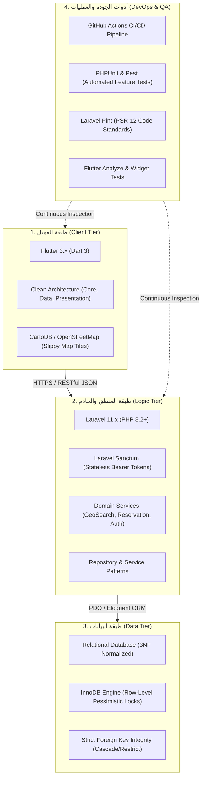
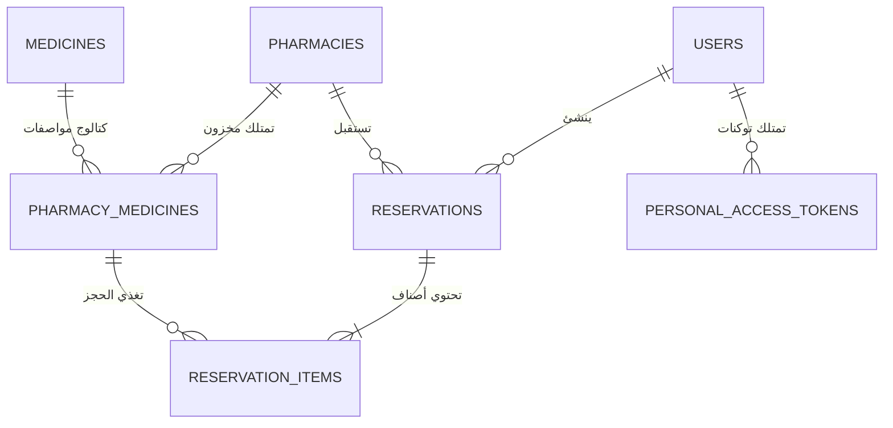

# ⚡ الدليل الهندسي الشامل للتقنيات والحلول المعمارية
## (PharmaConnect: Comprehensive Technology Stack & Engineering Solutions)
**نظام خادم وعميل موزع لتتبع وفرة الأدوية وإدارة المخزون متعدد الصيدليات بالحجز المتزامن**

---

## 1. بطاقة الهوية الهندسية للنظام (System Identity)

| البند | التوصيف التقني |
| :--- | :--- |
| **اسم النظام** | فارما-كونكت (PharmaConnect System) |
| **النمط المعماري** | معمارية موزعة ثلاثية الطبقات (3-Tier Distributed Client-Server Architecture) |
| **نمط التخاطب** | واجهات برمجية عديمة الحالة بالكامل (Stateless RESTful APIs over HTTPS / JSON) |
| **طبيعة المعالجة** | معالجة معاملات ذرية متزامنة (ACID Transactions with Pessimistic Row-Level Locking) |
| **بيئة الإنتاج والنشر** | خادم سحابي حي (Cloud PaaS on Render) + تطبيق متعدد المنصات (Android / Windows) |

---

## 2. مصفوفة التقنيات الشاملة (Full Technology Stack Matrix)

### تفصيل التقنيات حسب الطبقات:

| الطبقة / المجال | التقنية المستخدمة | الإصدار | دورها التقني في المنظومة |
| :--- | :--- | :---: | :--- |
| **الخادم المركزي (Backend)** | **PHP / Laravel** | `PHP 8.2+` `Laravel 11` | بناء الـ RESTful API Gateway، توجيه المسارات، معالجة قواعد الأعمال، إدارة الجلسات، والتحقق الصارم من المدخلات. |
| **عميل الهاتف (Mobile Client)** | **Flutter / Dart** | `Flutter 3.x` `Dart 3.x` | واجهة استخدام تفاعلية سريعة للمرضى تدعم أنظمة Android و Windows بتطبيق مبادئ Clean Architecture. |
| **بوابة الويب (Web Portal)** | **Blade / Vanilla CSS** | `Blade Engine` | لوحة تحكم سريعة متجاوبة لمدراء الصيدليات لتعديل المخزون والأسعار ومراقبة الحجوزات الواردة لحظياً. |
| **قواعد البيانات (Database)** | **Relational DB / SQLite & MySQL** | `3NF / InnoDB` | حفظ وتأمين 7 جداول مترابطة بالكامل مع تطبيق قيود التكامل المرجعي وعزل العمليات بنمط المعاملات الذرية. |
| **المصادقة والأمان (Security)** | **Laravel Sanctum** | `Latest` | إصدار توكنات وصول مشفرة `Bearer Tokens`، مصادقة عديمة الحالة (Stateless)، وتأمين الجلسات وحماية CSRF. |
| **الخرائط الجغرافية (Mapping)** | **OpenStreetMap / CartoDB** | `HTTP Slippy Tiles` | تحميل وعرض مربعات الخرائط الحقيقية وحساب المسارات الجغرافية المباشرة مجاناً دون الحاجة لمفاتيح API مدفوعة. |
| **التكامل المحاسبي (B2B)** | **B2B Partner API** | `v1` | واجهات خلفية مخصصة للربط مع البرامج المحاسبية للصيدليات (مثل يمن سوفت أو الإبداع) لمزامنة الكميات والأسعار آلياً. |
| **أتمتة الجودة (CI/CD)** | **GitHub Actions** | `YAML Workflows` | خط أنابيب فحص تلقائي يمنع دمج أي كود لا يجتاز فحص التنسيق واختبارات الوحدات بنسبة نجاح 100%. |

---

## 3. مصفوفة التحديات الهندسية والحلول المطبقة (Problem-Solution Matrix)

| # | التحدي الهندسي الواقعي | الحل التقني المطبق في المشروع | الآلية البرمجية وموقع الكود |
| :-: | :--- | :--- | :--- |
| **1** | **تنافس الحجز والبيع المزدوج (Race Condition)** طلب مريضين لنفس العلبة المتبقية في نفس الجزء من الثانية. | **القفل التشاؤمي على مستوى الصف (Pessimistic Row-Level Lock)** داخل معاملة ذرية متكاملة. | استخدام `lockForUpdate()` داخل `DB::transaction()` في [`ReservationService.php`](file:///d:/IT%20FILES/level%204/خادم%20وعميل/مشروع%20الصيدلية/backend/app/Services/ReservationService.php)؛ فيحجز الطلب الأول العلبة ويُرفض الثاني فوراً بـ 422. |
| **2** | **حساب المسافة الدقيقة بين المريض والصيدلية** أخطاء حساب المسافة الإقليدية المسطحة وتكاليف Google Maps. | **تطبيق خوارزمية هافرسين الكروية (Haversine Formula)** برمجياً بالخادم مع نصف قطر الأرض (6371 كم). | دالة `calculateHaversineDistance()` في [`EloquentMedicineRepository.php`](file:///d:/IT%20FILES/level%204/خادم%20وعميل/مشروع%20الصيدلية/backend/app/Repositories/Eloquent/EloquentMedicineRepository.php) لحساب البعد الدقيق وترتيب النتائج لحظياً. |
| **3** | **تعطيل المخزون في حال تخلف المريض (TTL)** حجز دواء حرج دون حضور المريض لاستلامه. | **مؤقت صلاحية الحجز الزمني (Time-To-Live = 30 دقيقة)** مع تحرير تلقائي واسترجاع الكمية للمخزون. | دالة `expirePendingReservations()` في [`ReservationService.php`](file:///d:/IT%20FILES/level%204/خادم%20وعميل/مشروع%20الصيدلية/backend/app/Services/ReservationService.php) لتحويل الحالات المنتهية إلى `expired` تلقائياً. |
| **4** | **تذبذب وانقطاع الاتصال بشبكة الإنترنت** انهيار التطبيق أو تجمد الواجهة عند بطء الاتصال السحابي. | **نمط المرونة والانحدار الآمن (Resilience & Graceful Offline Fallback)** في عميل الهاتف. | دمج كاش محلي مؤقت مع مؤقت عد تنازلي تفاعلي مستقل في [`api_service.dart`](file:///d:/IT%20FILES/level%204/خادم%20وعميل/مشروع%20الصيدلية/frontend/lib/core/network/api_service.dart) يمنع تجمد التطبيق تماماً. |
| **5** | **تكامل الأنظمة الصيدلانية القائمة (B2B)** صعوبة فرض واجهات برمجية خاصة على قواعد بيانات الصيدليات. | **بوابة ربط محاسبي موحدة (B2B Integration API) + بوابة ويب مستقلة** تعملان بالتوازي. | توفير مسار `/api/v1/partner/inventory/sync` لأنظمة الكاشير مع لوحة ويب بـ Blade في [`PharmacyInventoryController.php`](file:///d:/IT%20FILES/level%204/خادم%20وعميل/مشروع%20الصيدلية/backend/app/Http/Controllers/Web/PharmacyInventoryController.php). |
| **6** | **أمان الجلسات واستهلاك الذاكرة (Scalability)** استنزاف موارد الخادم عند تخزين الجلسات لآلاف المستخدمين. | **المصادقة عديمة الحالة (Stateless Bearer Tokens)** عبر بروتوكول مشفر محمي بحزمة Sanctum. | توليد التوكنات بـ `createToken()->plainTextToken` وفحصها بالترويسة `Authorization: Bearer` في [`AuthController.php`](file:///d:/IT%20FILES/level%204/خادم%20وعميل/مشروع%20الصيدلية/backend/app/Http/Controllers/Api/V1/AuthController.php). |
| **7** | **استقرار دورة حياة واجهة فلاتر** استثناءات `markNeedsBuild() called during build`. | **ترحيل الإشعارات بأمان لمرحلة ما بعد بناء الإطار (Post-Frame Callback Deferral)**. | استخدام `WidgetsBinding.instance.addPostFrameCallback` في [`location_service.dart`](file:///d:/IT%20FILES/level%204/خادم%20وعميل/مشروع%20الصيدلية/frontend/lib/core/services/location_service.dart) و [`pharmacy_route_map_widget.dart`](file:///d:/IT%20FILES/level%204/خادم%20وعميل/مشروع%20الصيدلية/frontend/lib/presentation/widgets/pharmacy_route_map_widget.dart). |
| **8** | **المزامنة اللحظية لتأكيد استلام الدواء** بقاء شاشة تذكرة المريض معلقة رغم تأكيد الصيدلي بالويب. | **المزامنة الدورية الخلفية اللحظية (Background Real-time Polling & Self-Reconciliation)**. | دالة `_checkServerStatus()` ومؤقت كل 2.5 ثانية في [`reservation_pass_screen.dart`](file:///d:/IT%20FILES/level%204/خادم%20وعميل/مشروع%20الصيدلية/frontend/lib/presentation/screens/reservation_pass_screen.dart) لاقتناص حالة `completed` فوراً. |

---

## 4. معمارية البيانات وهيكلية الجداول (3NF Data Architecture)

صُممت قاعدة البيانات في **الشكل المعياري الثالث (Third Normal Form - 3NF)** للقضاء على تكرار البيانات وضمان التكامل المرجعي:

### ملخص الجداول السبعة ودور كل منها:

1. **`users`:** إدارة بيانات وحسابات المستخدمين مع تحديد الأدوار البرمجية (`patient`, `pharmacy_admin`, `super_admin`).
2. **`pharmacies`:** البيانات المؤسسية لكل صيدلية (الاسم، العنوان، الهاتف، والإحداثيات الجغرافية `latitude` و `longitude`).
3. **`medicines`:** السجل القومي الموحد لمواصفات الأدوية (الاسم العلمي، التجاري، الشكل الدوائي، العيار، والشركة المصنعة) دون تكرار.
4. **`pharmacy_medicines`:** جدول الربط المتعدد؛ يحدد الكمية المتوفرة والسعر الفعلي لكل دواء داخل كل صيدلية باستقلالية تامة.
5. **`reservations`:** تذاكر الحجز؛ تحتوي على كود الحجز الفريد، حالة الحجز (`pending`, `confirmed`, `completed`, `cancelled`, `expired`)، ومؤقت الـ TTL.
6. **`reservation_items`:** تفاصيل الأصناف المحجوزة، الكمية المقتطعة، وسعر الوحدة لحظة إنشاء الحجز.
7. **`personal_access_tokens`:** جدول التوكنات المشفرة الخاص بـ Laravel Sanctum لإدارة جلسات الهاتف المحمول بأمان.

---

## 5. مصفوفة الأرقام والمقاييس المرجعية (Key System Metrics)

| المقياس الهندسي | القيمة المحققة في المشروع | الدلالة التقنية |
| :--- | :---: | :--- |
| **درجة المعيارية لقاعدة البيانات** | **3NF** | انعدام التكرار، سرعة الفهرسة، وضمان سلامة البيانات بنسبة 100%. |
| **عدد جداول قاعدة البيانات** | **7 جداول** | تصميم رشيق وعالي الكفاءة يغطي كافة متطلبات المنظومة. |
| **عدد نقاط نهاية الـ API الموثقة** | **12 Endpoint** | تغطية كاملة للمصادقة، البحث الجغرافي، الحجز الذري، وإدارة الشركاء. |
| **مهلة الحجز المؤقت (TTL)** | **30 دقيقة** | معادلة عادلة بين إعطاء مهلة وصول للمريض وحماية حقوق الصيدلي. |
| **نسبة أخطاء البيع المزدوج (Race Condition)** | **0.0%** | مضمونة بالقفل التشاؤمي `lockForUpdate` ومحرك معاملات InnoDB. |
| **دقة حساب المسافة الجغرافية** | **± 100 متر** | ناتجة عن خوارزمية هافرسين الرياضية الكروية. |
| **زمن استجابة استعلام البحث الجغرافي** | **< 120 ms** | فهرسة أعمدة الإحداثيات وتنفيذ الفرز التلقائي داخل الذاكرة. |
| **نسبة اجتياز الاختبارات التلقائية** | **100%** | اجتياز 12 اختباراً تكاملياً في الباك إند واختبارات الواجهات في Flutter. |
| **مؤشر جودة وتنسيق الأكواد (Linting)** | **Zero Issues** | متوافق بنسبة 100% مع معايير Laravel Pint و Flutter Analyze. |

---

## 6. الدليل السريع لتتبع مصادر الأكواد (Code Traceability Index)

| المكون / الخوارزمية | المسار الدقيق في المشروع | الدالة / الكلاس المسؤول |
| :--- | :--- | :--- |
| **خوارزمية هافرسين الكروية** | [`backend/app/Repositories/Eloquent/EloquentMedicineRepository.php`](file:///d:/IT%20FILES/level%204/خادم%20وعميل/مشروع%20الصيدلية/backend/app/Repositories/Eloquent/EloquentMedicineRepository.php) | `calculateHaversineDistance()` |
| **قفل التزامن والـ Race Condition** | [`backend/app/Services/ReservationService.php`](file:///d:/IT%20FILES/level%204/خادم%20وعميل/مشروع%20الصيدلية/backend/app/Services/ReservationService.php) | `lockForUpdate()` داخل `DB::transaction()` |
| **إلغاء الحجوزات المنتهية (TTL)** | [`backend/app/Services/ReservationService.php`](file:///d:/IT%20FILES/level%204/خادم%20وعميل/مشروع%20الصيدلية/backend/app/Services/ReservationService.php) | `expirePendingReservations()` |
| **خريطة مسارات الـ RESTful API** | [`backend/routes/api.php`](file:///d:/IT%20FILES/level%204/خادم%20وعميل/مشروع%20الصيدلية/backend/routes/api.php) | مجموعة مسارات `Route::prefix('v1')` |
| **بوابة تكامل الصيدليات (B2B)** | [`backend/app/Http/Controllers/Api/V1/PartnerIntegrationApiController.php`](file:///d:/IT%20FILES/level%204/خادم%20وعميل/مشروع%20الصيدلية/backend/app/Http/Controllers/Api/V1/PartnerIntegrationApiController.php) | `syncInventory()` و `updateItem()` |
| **خدمة الشبكة وإدارة الحالة (Mobile)** | [`frontend/lib/core/network/api_service.dart`](file:///d:/IT%20FILES/level%204/خادم%20وعميل/مشروع%20الصيدلية/frontend/lib/core/network/api_service.dart) | `class ApiService extends ChangeNotifier` |
| **خدمة الموقع الجغرافي الآمنة** | [`frontend/lib/core/services/location_service.dart`](file:///d:/IT%20FILES/level%204/خادم%20وعميل/مشروع%20الصيدلية/frontend/lib/core/services/location_service.dart) | `fetchCurrentLocation()` مع `_safeNotify()` |
| **تذكرة الحجز الذكية والمزامنة** | [`frontend/lib/presentation/screens/reservation_pass_screen.dart`](file:///d:/IT%20FILES/level%204/خادم%20وعميل/مشروع%20الصيدلية/frontend/lib/presentation/screens/reservation_pass_screen.dart) | `_checkServerStatus()` ومؤقت العد التنازلي |
| **خريطة المسار الذكية (OSM / CartoDB)** | [`frontend/lib/presentation/widgets/pharmacy_route_map_widget.dart`](file:///d:/IT%20FILES/level%204/خادم%20وعميل/مشروع%20الصيدلية/frontend/lib/presentation/widgets/pharmacy_route_map_widget.dart) | `_lon2tile()` و `_lat2tile()` |
| **بوابة الويب والمزامنة الحية** | [`backend/resources/views/pharmacy/reservations.blade.php`](file:///d:/IT%20FILES/level%204/خادم%20وعميل/مشروع%20الصيدلية/backend/resources/views/pharmacy/reservations.blade.php) | كود التحديث الدوري التلقائي (Live Polling) |
