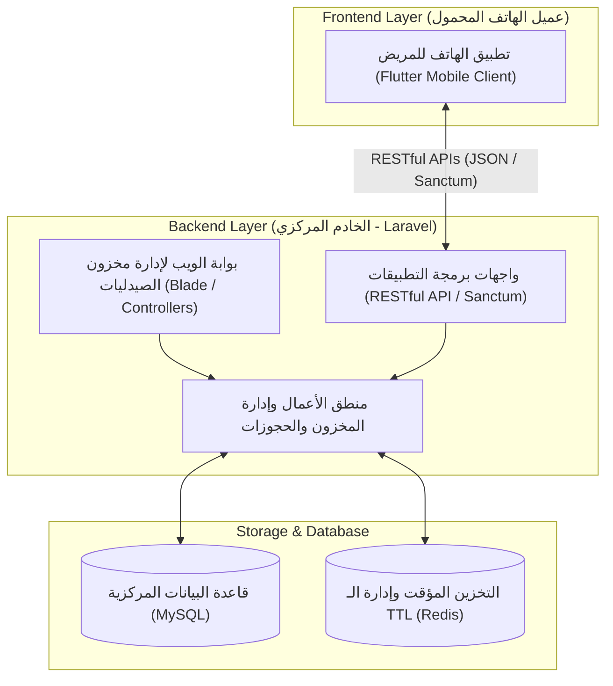

# وثيقة مقترح المشروع الرسمي (Project Proposal)
**المقرر:** خادم وعميل (Client-Server Architecture)  
**المستوى:** الرابع - تكنولوجيا المعلومات / علوم الحاسوب  
**التاريخ:** 2026-09-18  
**النسخة:** 1.2 (المعمارية المحدثة وتوزيع فريق العمل الثلاثي)

---

## 1. عنوان المشروع (Project Title)
* **العنوان باللغة العربية:**  
  **"فارما-كونكت (PharmaConnect): منصة موزعة لتتبع وفرة الأدوية والربط اللحظي بين الصيدليات بنمط خادم وعميل"**
* **العنوان باللغة الإنجليزية:**  
  *PharmaConnect: A Distributed Client-Server Platform for Real-Time Pharmaceutical Availability & Inventory Tracking*
* **المواصفات المحققة:**
  * **ملفت:** يبرز الترابط الموزع والحل الذكي المباشر.
  * **مختصر:** يُعرف اختصاراً باسم المنصة **(PharmaConnect)**.
  * **تقني:** يرتكز صراحة على معمارية الخادم والعميل (Client-Server Systems) متعددة العملاء (Multi-Client).
  * **يحدد المشكلة الأساسية:** تتبع وفرة الأدوية وتنسيق المخزون بين الصيدليات المتعددة.

---

## 2. المشكلة (Problem Statement)
### الطرح العام للمشكلة:
يواجه قطاع الرعاية الصيدلانية والمرضى في البيئة المحلية تحدياً معقداً ومزمناً يتمثل في تجزؤ بيانات المخزون الدوائي وانعدام الربط الشبكي بين الصيدليات. فنظراً لعدم توفر أنظمة ربط إلكتروني موحدة أو واجهات ربط سحابية (APIs) مسبقة بين الصيدليات التجارية المختلفة، تعمل كل صيدلية بنظام محلي معزول، مما يضطر المريض إلى خوض رحلة بحث ميدانية شاقة ومهدرة للوقت والجهد للبحث عن أدويته في عشرات الصيدليات المتفرقة، في حين يفتقر الصيادلة إلى منصة مرنة لعرض مخزونهم المتوفر واستقبال الحجوزات أو تتبع نواقص السوق.

### المشاكل الفرعية الثلاث المحددة:
1. **المشكلة الأولى (عزلة الصيدليات وغياب نظام ربط موحد):**  
   عدم وجود بنية تحتية أو واجهات موحدة تربط بين الصيدليات التجارية المختلفة، مما يجعل مخزون كل صيدلية معزولاً عن متناول المرضى والصيدليات الأخرى.
2. **المشكلة الثانية (استنزاف وقت المريض في البحث والتنقل):**  
   هدر وقت وجهد المريض وتأخر تلقي العلاج في الحالات الحرجة نتيجة الاضطرار للزيارة الميدانية أو الاتصالات الهاتفية العشوائية لمعرفة توفر الدواء.
3. **المشكلة الثالثة (عدم دقة المزامنة ونفاد الدواء أثناء التوجه للصيدلية):**  
   غياب آلية حجز لحظي مؤقت تضمن حجز الدواء للمريض ريثما يصل إلى الصيدلية، مما يؤدي إلى نفاد الدواء قبل وصوله.

---

## 3. الأهداف (Project Objectives)
*(تمت صياغة الأهداف الثلاثة لمعالجة المشاكل المحددة بدقة عبر معمارية خادم وعميل متكاملة):*
1. **الهدف الأول (حل للمشكلة الأولى - بوابة الويب لإدارة المخزون وتعدد الصيدليات):**  
   تطوير نظام ويب متكامل مبني بإطار عمل **Laravel** يمثل بوابة إدارة مخزون لكل صيدلية (Multi-Tenant Inventory Web Portal)؛ حيث يتاح لكل صيدلية حساب خاص لإدارة مخزونها من الأدوية (إضافة، تعديل الكميات والأسعار، وحالة التوفر) دون الحاجة لربطها بأنظمة خارجية معقدة.
2. **الهدف الثاني (حل للمشكلة الثانية - تطبيق عميل الهاتف للبحث الجغرافي):**  
   تطوير تطبيق عميل للهواتف الذكية بنظام **Flutter** متصل بالخادم عبر واجهات برمجة التطبيقات (RESTful API)، يمكن المريض من البحث اللحظي عن أي دواء وعرض قائمة بالصيدليات المسجلة التي يتوفر لديها الدواء ومواقعها الجغرافية مع الأسعار.
3. **الهدف الثالث (حل للمشكلة الثالثة - خادم الحجز اللحظي والتزامن):**  
   بناء منطق خادم (Backend Server Logic) يوفر خدمة الحجز المؤقت المؤكد (Hold/Reservation with TTL) مع مزامنة فورية للمخزون، بحيث يُحجز الصنف للمريض لفترة زمنية محددة ويتم خصمه مؤقتاً من مخزون الصيدلية لتفادي التعارض ونفاد الصنف.

---

## 4. الأهمية (Significance & Value Proposition)
* **أين يكمن؟**  
  تكمن أهمية المشروع في تقديم حل عملي وواقعي يدمج مفاهيم **برمجة الخادم والعميل (Client-Server Programming)** من خلال توفير **نظام مزدوج العملاء (Multi-Client Architecture)**: عميل ويب للصيدلي لإدارة المخزون، وعميل هاتف للمريض للاستعلام والحجز، يربطهما خادم مركزي وقاعدة بيانات موحدة.
* **أين يُستخدم؟**  
  * **عبر متصفحات الويب (`/backend` Web Portal):** تستخدمه الصيدليات المتعددة كنظام مخزون رقمي سهل الاستخدام وسحابي.
  * **عبر تطبيقات الهواتف الذكية (`/frontend` Mobile App):** يستخدمه المرضى والمواطنون للبحث والوصول الفوري للأدوية.
  * **لوحة إدارة النظام (Admin Panel):** لإدارة الصيدليات المسجلة وتأكيد صلاحياتها وإحصائيات الوفرة الدوائية.
* **أبرز المميزات:**  
  * **دعم تعدد الصيدليات (Multi-Pharmacy Support):** مرونة تسجيل أي عدد من الصيدليات وفصل بيانات مخزونها.
  * **التركيز على إدارة المخزون (Dedicated Inventory Management):** واجهة ويب ميسرة للصيدلي لإدخال الأصناف وتحديث كمياتها وأسعارها بدقة.
  * **الربط اللحظي بين الويب والموبايل:** التحديث الفوري في مخزون صفحة ويب الصيدلية ينعكس في نفس اللحظة في نتائج بحث تطبيق الهاتف عبر الـ API.
  * **الحجز المؤقت الآمن:** حماية حقوق المريض والصيدلي عبر مؤقت حجز زمني ذكي.
  * **خطوط التكامل المستمر (CI/CD):** فحص تلقائي للأكواد بـ Laravel Pint و PHPUnit و Flutter Test.

---

## 5. التقنيات والأدوات المقترحة (Proposed Tech Stack & Architecture)

* **جانب الخادم وإدارة الويب (`/backend`):**
  * **PHP 8.2+ / Laravel Framework:** صفحات الويب للمخزون + واجهات RESTful APIs.
  * **MySQL:** قاعدة البيانات المركزية لمعالجة العمليات المتزامنة وحفظ المخزون.
  * **Redis:** مؤقتات الحجز والتخزين المؤقت السريع.
  * **Laravel Pint & PHPUnit:** لضمان التنسيق واختبارات الجودة المؤتمتة.
* **جانب عميل الهاتف (`/frontend`):**
  * **Flutter (Dart):** تطبيق العميل عالي الأداء مع إدارة الحالة وتصميم طبي باللون الأخضر والأبيض.
  * **Flutter Test & Analyze:** للفحص البرمجي التلقائي.
* **التوثيق والمعمارية (`/docs`):**
  * مخططات UML، مواصفات الـ SRS، توثيق الـ APIs عبر Postman، وتوثيق المراجع بـ **APA 7th Edition**.

---

## 6. الخطة الزمنية المقترحة (مخطط جانت - Gantt Chart)

| المرحلة | المهام التفصيلية | الفترة الزمنية (الأسابيع) | المخرجات المتوقعة |
|---|---|:---:|---|
| **1. التخطيط وجمع المتطلبات (Requirements & Planning)** | دراسة الجدوى، تحديد متطلبات تعدد الصيدليات، إعداد وثيقة متطلبات النظام (SRS). | الأسبوع 1 - 2 | وثيقة SRS ومقترح المشروع المعتمد |
| **2. التحليل والتصميم المعماري (Analysis & Design)** | تصميم معمارية خادم-وعميل متعددة الصيدليات، مخططات UML وERD، وتصميم شاشات Figma. | الأسبوع 3 - 4 | مخططات UML ونماذج الشاشات Figma |
| **3. إعداد البيئة وقواعد البيانات (Environment & Database)** | إنشاء جداول الصيدليات، المخزون، والأدوية في MySQL، وإعداد مشروع Laravel وFlutter و CI/CD. | الأسبوع 5 | بيئة العمل وقواعد البيانات و CI/CD جاهزة |
| **4. تطوير الخادم وبوابة مخزون الويب (Laravel Back-End & Web)** | برمجة صفحات ويب إدارة المخزون للصيادلة، وبرمجة واجهات REST API للبحث والحجز. | الأسبوع 6 - 8 | نظام مخزون ويب شغال + APIs موثقة عبر Postman |
| **5. تطوير تطبيق المريض (Flutter Mobile Client)** | بناء شاشات البحث عن الأدوية، عرض الخرائط، وشاشات تأكيد الحجز وإشعارات التوفر. | الأسبوع 8 - 10 | تطبيق الهاتف جاهز ومتكامل مع الـ APIs |
| **6. التكامل والاختبار وضمان الجودة (Integration & QA)** | اختبار توافق عمليات تعديل المخزون مع نتائج تطبيق الهاتف، واختبار ضغط العمليات المتزامنة بـ CI/CD. | الأسبوع 11 - 12 | نظام متكامل ومختبر بنجاح وخالٍ من الثغرات |
| **7. النشر والتوثيق والمناقشة (Deployment & Final Defense)** | رفع النظام على استضافة سحابية، إعداد الدليل والتوثيق الأكاديمي وفق APA 7، والمناقشة. | الأسبوع 13 - 14 | مشروع منشور، توثيق نهائي، وعرض تقديمي |

---

## 7. أسماء المجموعة وبيانات أعضاء الفريق (3 أعضاء)

| الرقم | اسم الطالب | الرقم الأكاديمي | الدور والمسؤولية الفنية في المشروع |
|:---:|:---|:---:|:---|
| **1** | [اسم الطالب 1] | [الرقم الأكاديمي] | **قائد الفريق & مهندس الخادم والـ API وقواعد البيانات (Backend Lead & Database Architect)** |
| **2** | [اسم الطالب 2] | [الرقم الأكاديمي] | **مهندس تطبيقات العميل الهاتفي (Mobile Client Developer / Flutter & State Management)** |
| **3** | [اسم الطالب 3] | [الرقم الأكاديمي] | **مهندس صفحات ويب إدارة المخزون وتجربة المستخدم (Web Portal Lead & UI/UX Specialist)** |

---

## المراجع (References - APA 7th Edition)
1. Sommerville, I. (2016). *Software Engineering* (10th ed.). Pearson Education.
2. Fielding, R. T. (2000). *Architectural Styles and the Design of Network-based Software Architectures* (Doctoral dissertation). University of California, Irvine.
3. Stauffer, M. (2019). *Laravel: Up & Running: A Framework for Building Modern PHP Apps* (2nd ed.). O'Reilly Media.
4. Windmill, E. (2020). *Flutter in Action*. Manning Publications.
